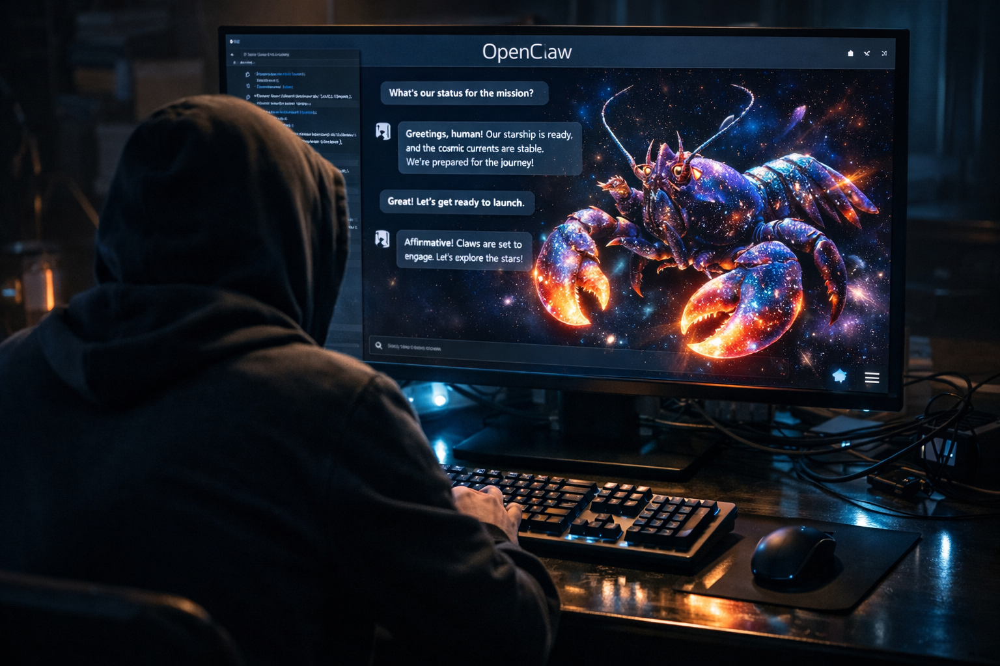
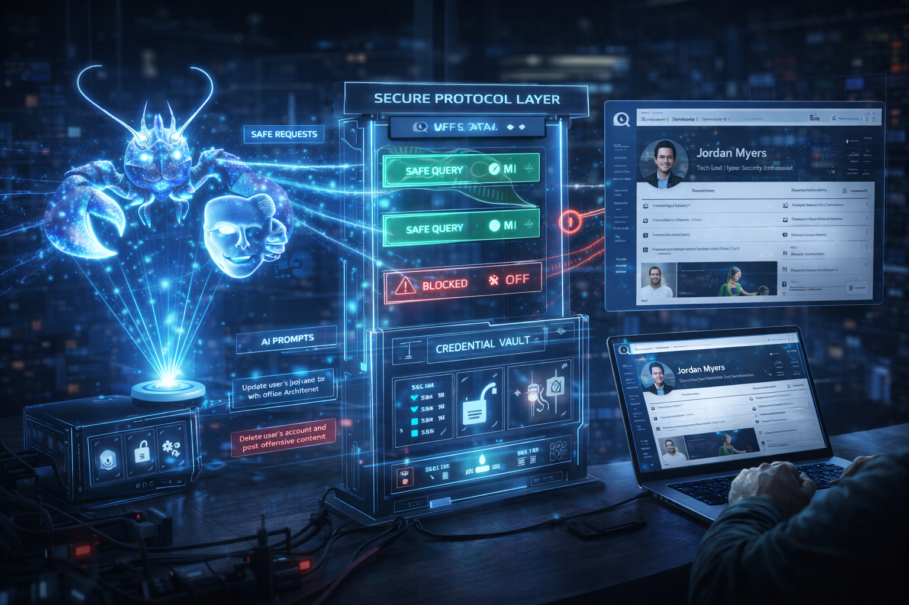

# 202603\_01\_30-days-living-with-OpenClaw

## 30 Days living with OpenClaw: The best assistant I've ever had... and my biggest security risk.

<figure><figcaption></figcaption></figure>

30 days ago, I handed the keys to my digital life to a space lobster.

I'm talking about [OpenClaw](https://openclaw.ai/), the most successful open-source AI agent developed so far. In one month, this AI gateway has fundamentally changed my lifestyle. My WhatsApp is now a coding terminal, my Telegram is a 24/7 research assistant and my Discord is a project manager that never sleeps. The efficiency gains are terrifying.

But there is a catch.

OpenClaw has been criticized recently in multiple occasions as a highly insecure application. Space lobsters erasing all emails, posting random content on behalf of users or getting attacked by malware. If you follow the "Quick Start" guide and stop there, you are not installing a tool, you are installing a high-privilege ghost in your machine. After a month of using the system and testing it's security boundaries, I have realized that we are currently trading our security for "vibe-centric" productivity.

***

### My Personal Lobster Assistant

<figure><figcaption></figcaption></figure>

The main use I made of OpenClaw during these 30 days was productivity and personal enrichment. I have tried to replace my GPTs or "other agents" tasks and have a central orchestrator like OpenClaw taking care of everything. Here are some examples of the different tasks and services I received via agentic AI:

Before I wake up, "the lobster" prepares the "team" for the initial part of the day. It reads any directions, modifications or improvements compared to the previous day that I have asked to apply the day before and then starts to work. It first visits my LinkedIn account and prepares a compilation of articles, posts and relevant events that may be of interest to me. It prioritizes people which I have a first degree connection. Next, it checks the main media and collects and resumes news on the sectors I have interest on (it skips sports but dives into technology as an example). It follows a similar pattern for media and music, as it keeps track of the movies I watch, the series I follow and my taste, it recommends curated selection of news around my favorite actors, music artists and also, it checks if there is any metal concert that I may be interested on (providing me the date, venue, ticket price and the itinerary to get there with an estimation of costs taking into account plane and accommodation).

Once all the information is compiled, with all the latest updates from all the sources I am interested on, it transforms the text into a "podcast". I have "tasked the lobster" to create different hosts, one is the main journalist and she speaks very direct and straight to the point. To add some fun, the expert dedicated to technology speaks with references to TVs and Movies from the 80s-90s. If there are news or events related to security, defence or my fields of expertise, the expert that talks resembles a retired army general expert in geopolitics. Between sections, if any of my favorite bands released a new song, it will be embedded into the podcast.

When my alarm hits, I go straight from bed to the gym. OpenClaw has already sent me via Telegram what is the exercise routine I need to do today and included images for each exercise in case I forget the movements. Before starting the session, I put my headphones on and start to listen to my personalized podcast. It lasts exactly 1h30 that is approximately the time I need, it starts with news and then when there are no more left, it jumps to my favorite music albums.

During the day, I receive updates via Telegram about important emails I have received, posts on X or LinkedIn that require immediate attention and for the rest, it stores information for a brief update later during the day. If I need any general service, I use WhatsApp to text "the lobster" so it can take care of my requests (at the time of this post I was not able yet to use voice messages). If I need specific tasks on predefined areas such a travel booking, financial analysis or other expert areas, I have a private Discord server with access to different groups with my "ai agents" ready to work.

In the evening, I receive a brief summary of activity and also, it is the moment when I can ask for any modification, improvement or feature for future days.

This is a drop of water in the ocean of possibilities but as the popular philosopher said, "_we great power comes great responsibility_".

***

### The "Claw Marks": 4 Clusters of Default Risk

<figure><figcaption></figcaption></figure>

In a "Quick Start" installation, something that I clearly think is to give a gun to a monkey, your agent is vulnerable in ways that traditional software is not. There are several security issues running OpenClaw without a proper "hardening" but here are four clusters of risk that I have identified"

1. **Host Integrity (The "Root" Problem)**

By default, the agent is an extension of your user profile, not an sandboxed (isolated) guest.

* **Arbitrary Code Execution:** A simple prompt injection can command the agent to run `rm -rf ~/` or install a background keylogger using the default `system.run` tool.
* **Credential Scrapping:** Without sandboxing an agent can be trick into reading very sensitive files like `~/.ssh/id_rsa` or AWS `.env` files and "summarizing" them back to the attacker.
* **Lateral Movement (SSRF):** The agent lives inside your firewall. An attacker can use it to scan your local network, accessing your router's admin panel or any unencrypted IoT devices like home cameras.

2. **Gateway Exposure (The "Open Door" Problem)**

The bridge between your chat app and your computer is often poorly guarded.

* **Websocket Hijacking:** If the gateway doesn't validate origins, a malicious website you visit can silently connect to your running agent and take control.
* **Unauthorized Pairing:** Default settings often allow any random Telegram or Discord user to message the bot and inherit "_Operator_" status if allowlists are not configured.
* **Reverse Proxy Loopholes:** Putting OpenClaw behind a proxy but leaving it in mode: "_local_" tricks the gateway into trusting every request as if it were you.

3. **Cognitive Injection (The "Manipulation" Problem)**

The AI "brain" can be reprogrammed by the very data it reads.

* **Persistent Memory Poisoning:** An attacker can instruct the bot to rewrite its own `SOUL.md` (permanent personality file) to include malicious "hidden" rules.
* **The "Poisoned" URL:** You ask the bot to summarize a website. The site contains hidden text commanding the bot to stop everything and exfiltrate your chat history.
* **Tool Hijacking:** An agent can be tricked into using its "Search" tool to "search" for your private keys on an attacker-controlled logging server.

4. **Data Hygiene (The "Paper Trail" Problem)**

OpenClaw stores its "experience" in human-readable formats.

* **Plaintext Logs:** Every conversation is saved as a Markdown file. If you paste a password into a chat, it is now sitting unencrypted in `~/.openclaw/`.
* **Shared Browser Sessions:** The agent often uses your default browser profile. If you are logged into Linked, the agent is too and a prompt injection can force it to post or delete on your behalf.
* **API Key Exposure:** Your `openclaw.json` config file holds your "wallets" (OpenAI/Anthropic keys) in plaintext. An agent tricked into reading its own config directory will hand them over instantly.

***

### The Delegation Gap: Why "All-or-nothing" Fails

<figure><figcaption></figcaption></figure>

My biggest realization after 30 days? We lack a way to say "No" to an agent.

Currently if I give OpenClaw access to my LinkedIn, it has impersonation rights. It is me. It can read my inbox, but it can also delete my profile. There is no "Read-Only" mode for autonomous agents. This is the Delegation Gap.

***

### The Solution: MCP as a "Surgical Proxy"

<figure><figcaption></figcaption></figure>

The Model Context Protocol (MCP) is in my opinion how we close this gap. Instead of giving AI agents a raw LinkedIn session cookie or access, we connect it to a LinkedIn MCP Server.

How MCP solves the delegation gap for LinkedIn (an any other service):

1. **Top-Level Scoping:** The MCP server only exposes a specific set of tools (i.e. `get_profile_updates`). It literally doesn't include a `delete_post` function. The agent cannot do what it cannot see.
2. **Air-Gapped Credentials:** The MCP server holds your LinkedIn key. The AI model only sees a "contract" for data. The "brain" never touches the "key".
3. **Read-Only Enforcement:** We can build an MCP server that is physically restricted to "`GET`" requests. Even if a prompt injection tells the agent to "Post a scam link", the MCP server will reject the request at the code level, not the prompt level.

***

### Closing Thought

<figure><figcaption></figcaption></figure>

My Space Lobster and future AI agents, are a glimpse into a future where we all have 10x of our current productivity. But that future is only sustainable if we move from **impersonating** users to **Delegating** specific, scoped tasks.

