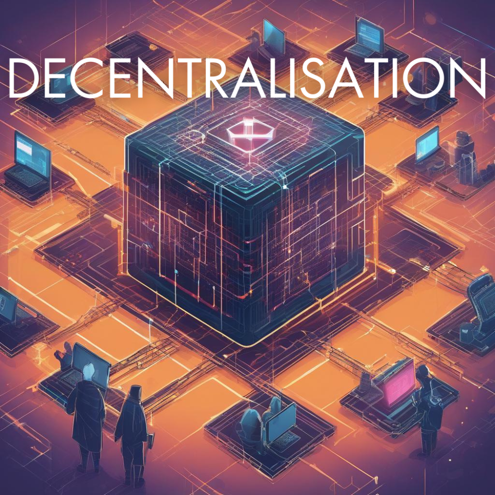
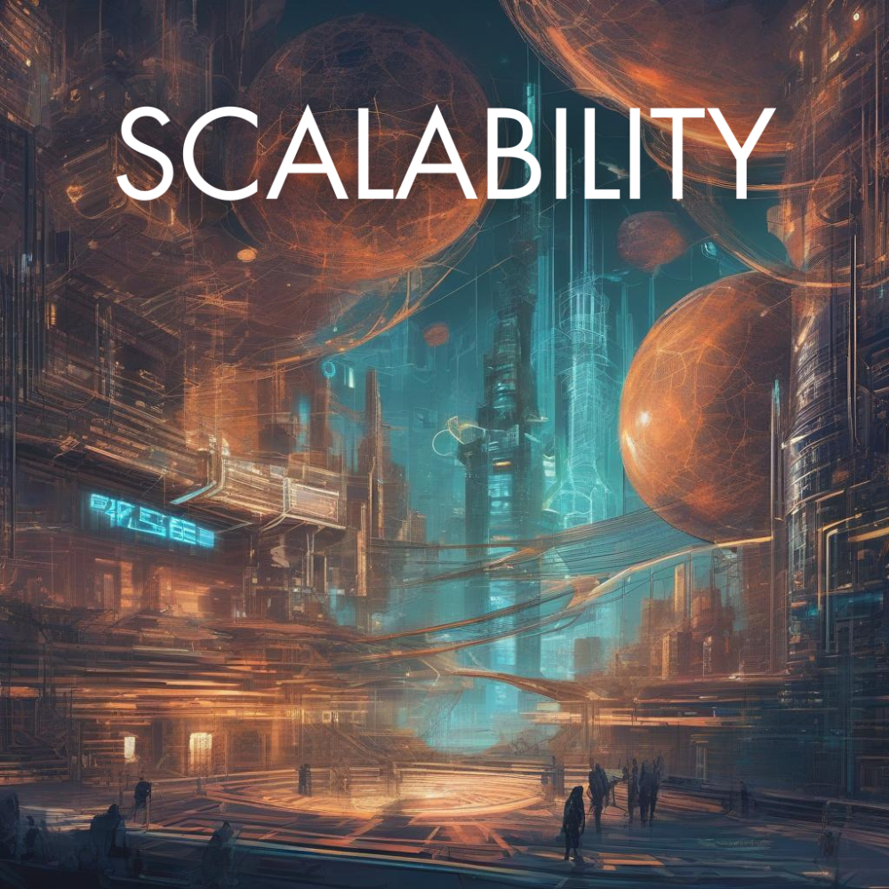

# 202404\_02\_The-Blockchain-Trilemma

Vitalik Buterin, co-founder of Ethereum, popularized a concept known as the blockchain trilemma. The idea behind is to find the optimal balance between three core properties in a blockchain network: security, decentralisation and scalability.

<figure><figcaption></figcaption></figure>

**Security.**

Directly tied to decentralisation, the more decentralised a blockchain is, the more secure it is against attacks and compromises. While blockchains are inherently secure due to their cryptographic nature, they are not completely immune to attacks. For instance, if a hacker gains control of more than 50% of the network’s nodes, they could potentially alter the blockchain and manipulate transactions.

***

<figure><figcaption></figcaption></figure>

**Decentralisation.**

A core principle of blockchain, ensuring no single entity controls the network, thus enhancing security and resistance to censorship. This refers to the distribution of control across a network, rather than having it centralized in a single entity. In blockchain, this means giving power to individuals to govern the network using their computers (nodes), rather than a central authority.

***

<figure><figcaption></figcaption></figure>

**Scalability.**

The ability to process transactions quickly and efficiently as the network grows, which can be challenging to achieve without affecting the other two points. This is about the network’s ability to handle growth and maintain performance. A scalable blockchain can process a high number of transactions without sacrificing speed or increasing costs.

 

### Conclusions: 

All blockchain projects try to balance the previously mentioned characteristics and it's the main reason why they are proficient in one aspect while lacking capabilities in others.

* A blockchain can be **secure** and **decentralised** but will limit its _scalability_: Bitcoin is the biggest example, known for its strong security and decentralised nature, with a large network of nodes. It's processing power is limited to approximately seven transactions per second (TPS), not scalable compared with other global financial systems.
* If it is **decentralised** and **scalable**, _security_ will be impacted: Projects that prioritize speed and decentralisation are more vulnerable to security breaches and hacks.
* If **scalable** and **secure**, it would be less _decentralised_: These kind of networks provide the highest levels of security and can handle high transactional outputs while having less nodes participating in the network and them being more centralised.

 

It’s challenging to achieve all three properties at their highest levels simultaneously. For example, increasing scalability may lead to a less decentralised network, which could reduce security. Various projects are exploring innovative solutions like sharding, side-chains, and state channels to address the trilemma.
