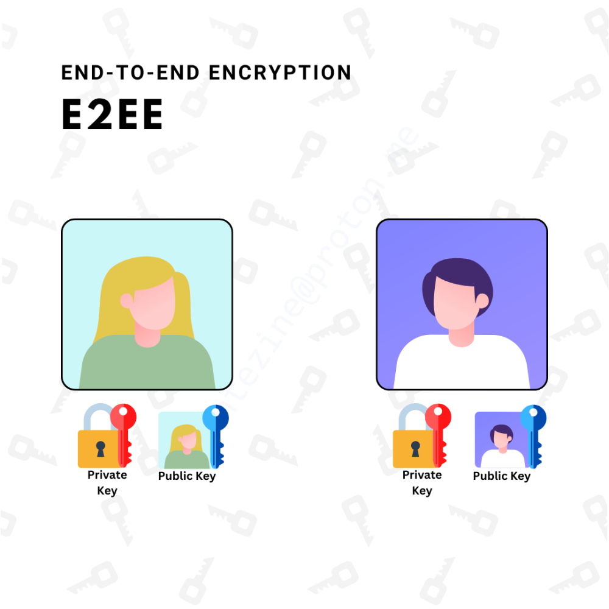
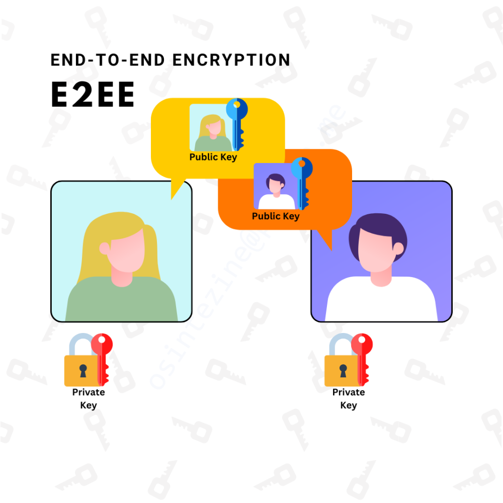
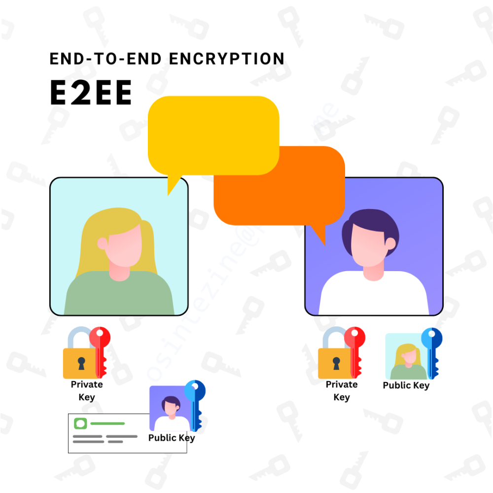
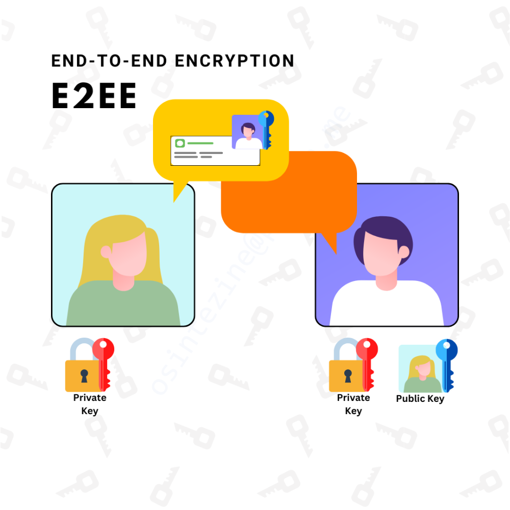
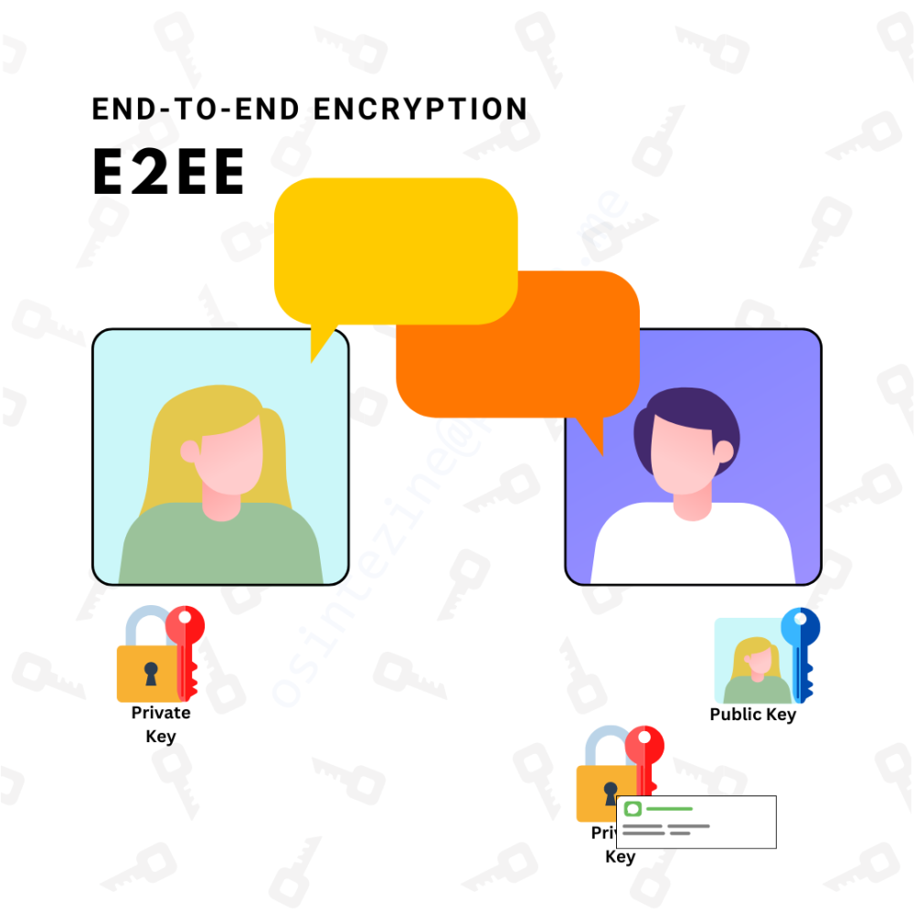

# 202405\_01\_Challenges-of-End-to-End-Encryption

End-to-End Encryption (E2EE) it's a privacy technology used to secure communications. The aim is to make sure that no one else can read the messages or data being exchanged. In this way, even if someone intercepts the communication during transmission, they won't be able to read the content.

The European Union is [concerned](https://www.europarl.europa.eu/RegData/etudes/ATAG/2023/751473/EPRS_ATA\(2023\)751473_EN.pdf) about E2EE. Social media platforms such as Facebook or WhatsApp started to implement this technology to protect the privacy of their users but at the same time, it pose increased [difficulties](https://www.europol.europa.eu/media-press/newsroom/news/european-police-chiefs-call-for-industry-and-governments-to-take-action-against-end-to-end-encryption-roll-out) to law enforcement investigations in crime areas such as child sexual abuse (CSA).

 

### How End-to-End Encryption Works. 

E2EE is a type of encryption that involves encrypting data both at the point where it is created (the "end") and at the point where it is received (also, the "end").

 

**Key Generation.**

<figure><figcaption>
Key Generation Process
</figcaption></figure>

Users involved in the communication generate public and private keys, that keys are stored securely on their devices. When using a service that provides E2EE, the application generates them automatically in a process transparent for the users.

 

**Key Exchange.**

<figure><figcaption>
Key Exchange.
</figcaption></figure>

Once the users want to start a conversation, their public keys are share between the devices they want to communicate with.

 

**Encryption and Decryption.**

<figure><figcaption>
Message Encryption.
</figcaption></figure>

Messages are encrypted with the recipient's public key and can only be decrypted by the recipient's private key.

<figure><figcaption>
Encrypted Message Transport.
</figcaption></figure>

<figure><figcaption>
Message Decryption.
</figcaption></figure>

Using E2EE provides a high level of security against eavesdropping, tampering, and interception, as any attempts to access the encrypted data without authorization would be futile.

 

### Challenges of End-to-End Encryption. 

As explained before, the data is encrypted when transmitted. In order to access the data, the only way is to have physical access to the device to obtain public and private keys. In case of illegal activities, Online Service Providers (OSP's) can only provide to law enforcement authorities information related to metadata such as identifiers of the users, timestamps or amount of traffic generated but the content cannot be accessed.

 

### Future Solutions. 

<figure><figcaption>
Stable Diffusion XL
</figcaption></figure>

Currently there are two techniques that can be implemented to use E2EE and at the same time, complying to legal requests such as the sharing of illegal material.

Homomorphic encryption (HE) and zero-knowledge proofs (ZKPs) are advanced cryptographic techniques that can potentially address some of the challenges associated with illegal content on end-to-end encrypted (E2EE) messaging platforms.

**Homomorphic Encryption (HE)** allows computations to be performed on encrypted data without needing to decrypt it first. This means that data can be processed by third parties without them ever seeing the actual data.

**Zero-Knowledge Proofs (ZKPs)**, on the other hand, enable one party to prove to another that a statement is true without revealing any information beyond the validity of the statement itself.

 

When combined, these two technologies could offer a way to detect and prevent the spread of illegal content on E2EE platforms while preserving privacy. For instance, HE could allow a service provider to perform content analysis on encrypted messages to detect illegal material. If illegal content is detected, a ZKP could be used to prove the presence of such content to the appropriate authorities without revealing any other information about the message.

However, there are challenges to this approach. The computational overhead of HE and ZKPs can be significant, which might not be practical for real-time communication.

 

### Conclusion. 

End-to-End Encryption is a crucial technology for securing communications, ensuring that only authorized parties can read messages or data exchanged. While E2EE provides unparalleled security against eavesdropping and tampering, it poses challenges for law enforcement investigations, particularly in cases of child sexual abuse. Social media platforms like Facebook and WhatsApp have implemented E2EE to protect user privacy but may need to find a balance between security and cooperation with authorities. Advanced cryptographic techniques like Homomorphic Encryption (HE) and Zero-Knowledge Proofs (ZKPs) could potentially address some challenges by enabling content analysis on encrypted data while preserving privacy. However, these technologies also come with significant computational overhead, which must be carefully considered in real-time communication scenarios. Ultimately, finding a balance between security, privacy, and cooperation will be crucial for the future of E2EE-enabled messaging platforms.
