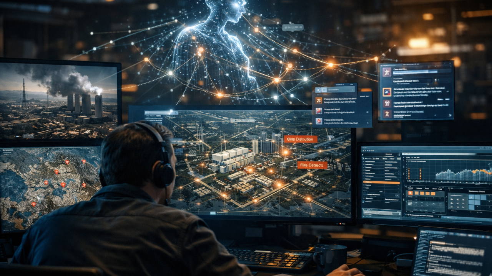
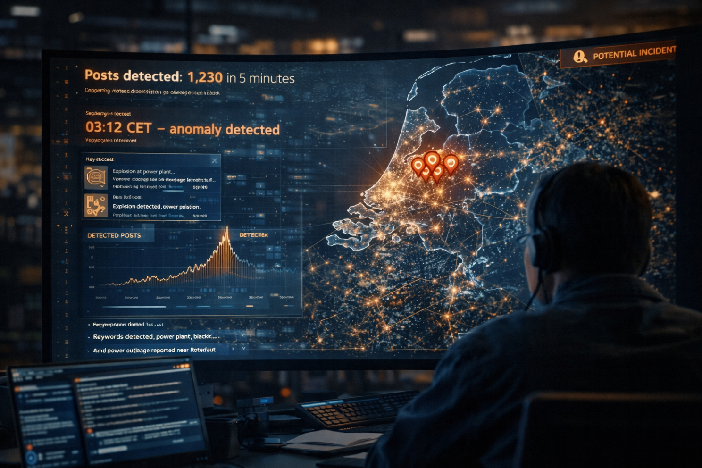
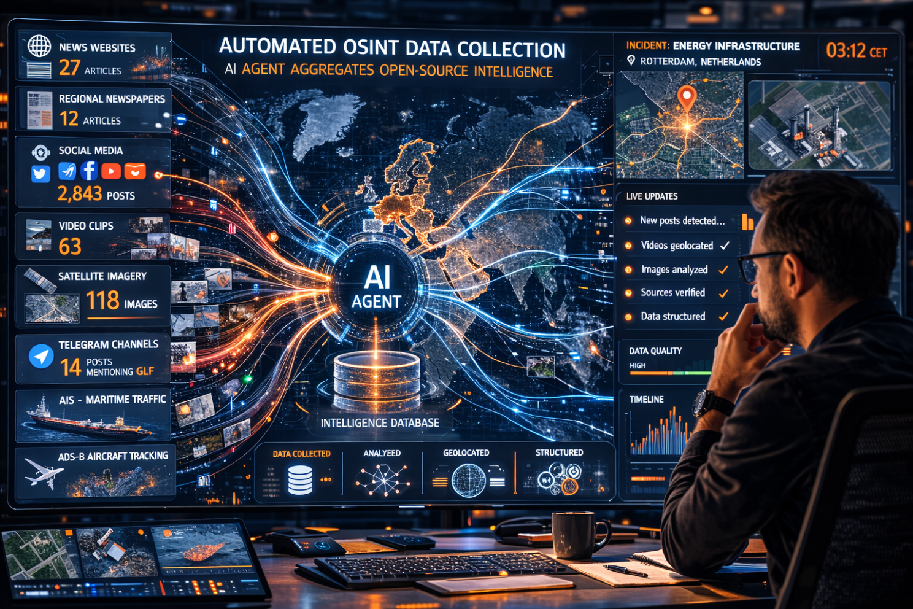
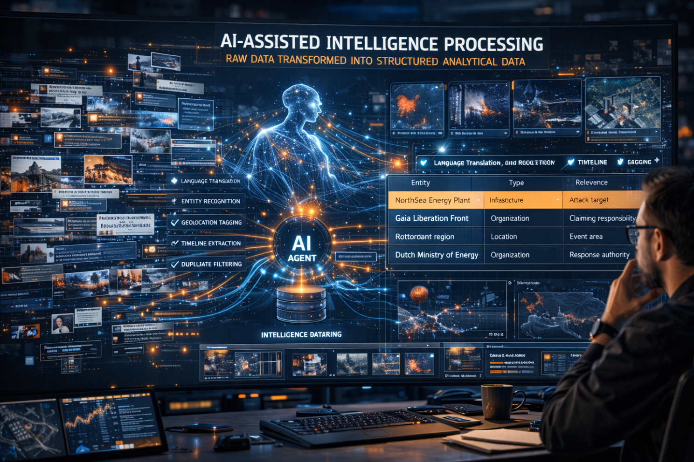
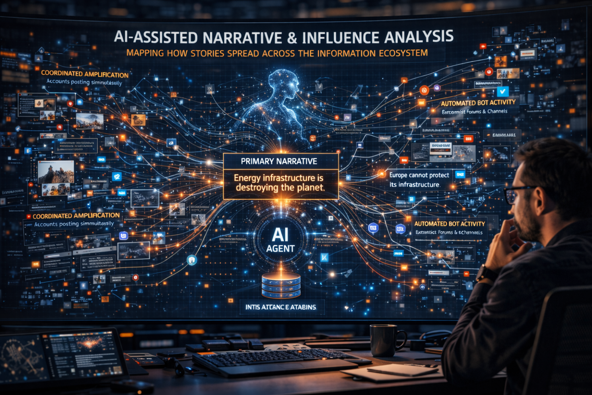
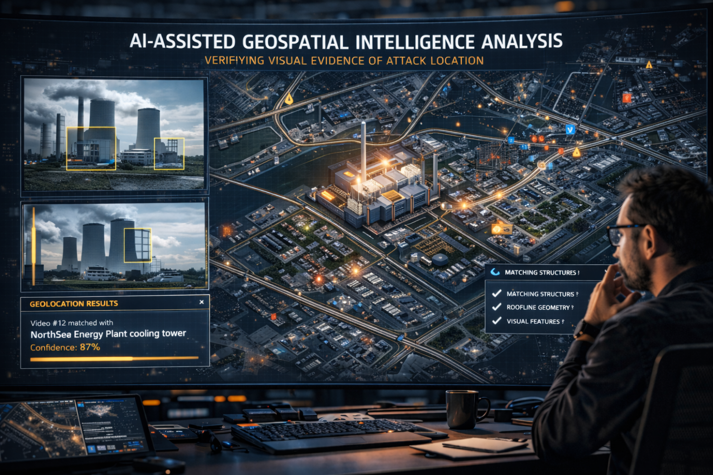
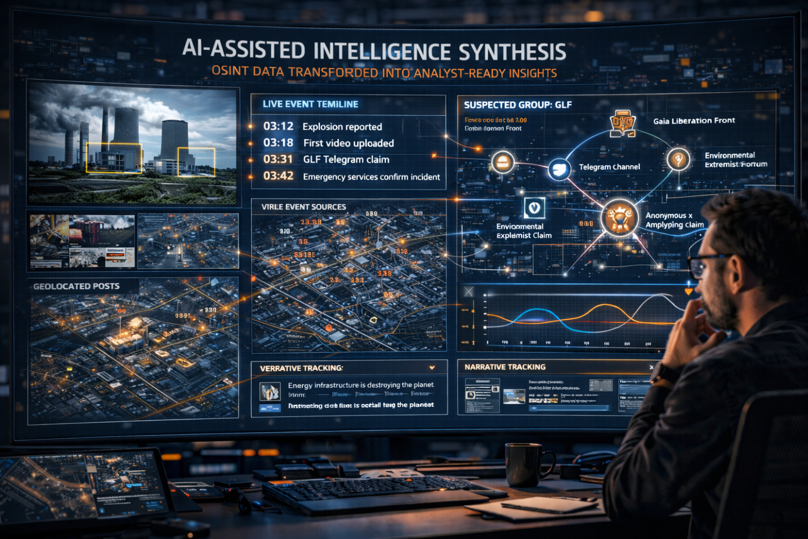
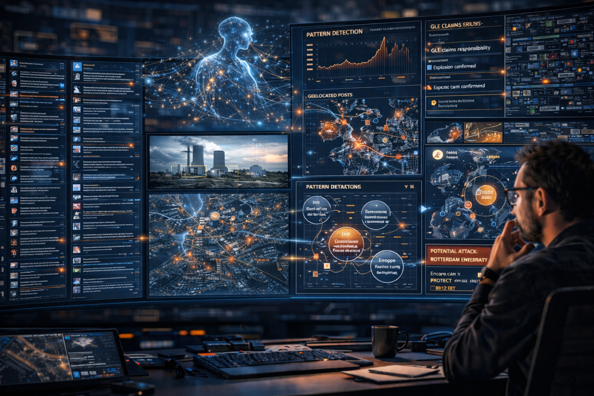

# 202603\_02\_AI\_Agents\_as\_OSINT\_Analysts

## How AI Agents Could Help OSINT Analysts Monitor a Terrorist Attack on European Energy Infrastructure


\
Imagine a fictional situation:

<figure><figcaption></figcaption></figure>

A previously unknown eco-extremist group called "**Gaia Liberation Front (GFL)**" claims responsibility for an attack on a major European energy power plant.

Within minutes, information begins spreading across:

* Social media
* Encrypted messaging channels
* Local news outlets
* Satellite imagery services
* Public infrastructure monitoring systems

The challenge for analysts is not finding information but processing it fast enough to generate insights and actionable intelligence.

This is where AI agents can become powerful OSINT co-analysts.

[My previous article](../artificial-intelligence-and-defence/202603_01_30-days-living-with-openclaw.md) described what AI agents can provide for personal productivity but in this one, I will be covering a more operational and practical usage.

***

#### Step 1 - Event Detection <a href="#ember61" id="ember61"></a>

<figure><figcaption></figcaption></figure>

An AI **monitoring agent** continuously scans the web. It can be easily programmed also to work in other networks such as the deep web or decentralised ones.

The AI agent detects anomalies based on predefined keywords such as:

* Sudden spikes in posts mentioning "_explosion_", "_power plan_", "_blackout_"
* Local emergency services alerts
* Unusual activity around the facility

Example of signal detection:

```
03:12 CET - Social media spike detected
Keywords: explosion; power plant; Rotterdam region
Posts detected: 1230 in 5 minutes
```

The agent alert the analyst via WhatsApp (or Telegram, or Signal...) that a potential incident has occurred.

***

#### Step 2 - Automated OSINT Collection <a href="#ember68" id="ember68"></a>

<figure><figcaption></figcaption></figure>

Once the event is confirmed by the human OSINT analyst, a **collection agent** begins gathering data. Sources may include:

**Media**

* Breaking news websites
* Regional newspapers
* Television livestreams

**Social Media**

* X / Bluesky posts
* TikTok videos
* Instagram images and comments

**Messaging Platforms**

* Telegram channels
* Extremist forums

**Geospatial Sources**

* Satellite imagery providers
* AIS maritime traffic
* ADS-B aircraft data

Example of output:

```
Collected data

News articles: 27
Social media posts: 2843
Videos: 63
Images: 118
Telegram posts mentioning GLF: 14
```

Instead of spending hours collecting information manually, analysts receive an immediate dataset to review.

***

#### Step 3 - Data Structuring <a href="#ember81" id="ember81"></a>

<figure><figcaption></figcaption></figure>

Raw information is messy. The export from public services via API or similar provides the data in different formats, naming conventions and structures.

A **data processing** agent transforms it into structured intelligence, including tasks like:

* Language translation
* Entity recognition
* Geolocation
* Timeline extraction
* Duplicate filtering

Example of structured output:

```
|        Entity         |     Type       |         Relevance       |
--------------------------------------------------------------------
| NorthSea Energy Plant | Infrastructure | Attack target           |
| Gaia Liberation Front | Organization   | Claiming responsibility |
| Rotterdam region      | Location       | Event area              |
| NL Ministry of Energy | Organization   | Response authority      | 
```

***

#### Step 4 - Narrative and Actor Analysis <a href="#ember87" id="ember87"></a>

<figure><figcaption></figcaption></figure>

A specialised **analysis agent** evaluates emerging narratives. It is trained on specific data related to extremist and terrorist groups such as academic researches, public information from open sources (like forums and websites) and other publications. Questions that it could answer:

* Is the terrorist claim authentic?
* Are coordinated influence campaigns amplifying the event?
* Are other groups referencing the attack?

Example of analysis output:

```
Narrative analysis

Primary narrative:
"Energy infrastructure is destroying the planet"

Secondary narratives detected:
"Europe cannot protect its infrastructure"
"This attack will inspire others"
```

The agent can also detect bot amplification or coordinated messaging across all the platforms monitored.

***

#### Step 5 - Geospatial Analysis <a href="#ember93" id="ember93"></a>

<figure><figcaption></figcaption></figure>

Another agent is specialized in analysing imagery and location data. Tasks include:

* Identifying the exact power plant location
* Geolocating videos
* Assessing visible damage
* Mapping emergency response

Example:

```
Geolocation results:

Video #12 matched with
NorthSea Energy Plant cooling tower
Confidence: 87%
```

This helps analysts verify whether visual evidence matches the claimed attack site.

***

#### Step 6 - Insight Generation <a href="#ember99" id="ember99"></a>


<figure><figcaption></figcaption></figure>

The final stage is producing analyst-ready intelligence products. Instead of raw data, the AI system generates:

```
Event timeline

Time    Event
03:12   Explosion reported
03:18   First video uploaded
03:31   GLF Telegram claim
03:42   Emergency services confirm incident
```

```
Actor network

GLF
 |--- Telegram channel
 |--- Environmental extremist forum
 |___ Anonymous X account amplifying claim
```

**Situational dashboard:**

* Live event timeline
* Map of related posts
* Narrative tracking
* Actor networks
* Key sources

***

**Why AI Agents Matter in This Scenario**

<figure><figcaption></figcaption></figure>

Major events generate information chaos. Thousands of posts, images and claims appear within minutes flooding the Internet. AI agents can help analysts:

* Monitor hundreds of sources simultaneously
* Filter noise from signal
* Detect patterns
* Generated rapid situational awareness

But **human analysts remain critical**. They validate sources, detect deception and provide contextual understanding.


If AI agents could monitor thousands of open sources in real time during a crisis, would that make OSINT analysis faster or just noisier?
