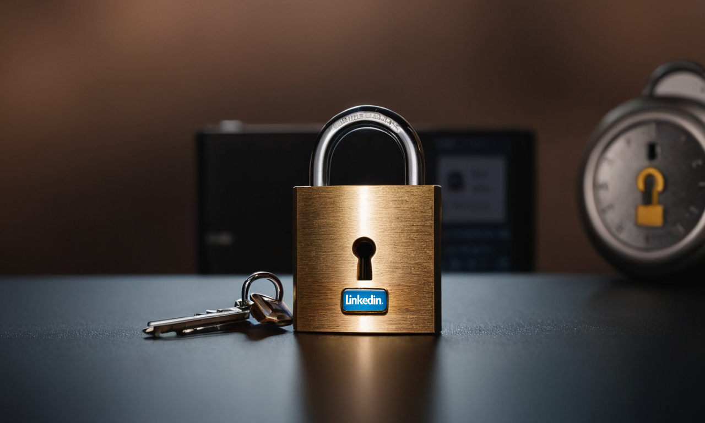

# 202406\_01\_Essential-LinkedIn-Security-Steps

I've decided to make my LinkedIn profile public to increase my professional visibility. Before doing so, I underwent a comprehensive "profile hardening" process. This involves scrutinizing my own profile as I would in any of my OSINT investigations, performing the following steps:

**Identify Critical Information**: My profile does not disclose my real location, but I do share events I’ve participated in, such as talks and training sessions. Additionally, I had previously shared pictures where my face can be seen or other details I prefer not to have publicly available.

**Analyze the Threats**: As a cybersecurity professional, one of the biggest threats I face, similar to most online users, relates to electronic crimes such as scams, hijacking, data leaks, or malware delivery.

**Analyze the Vulnerabilities**: While my LinkedIn account has several security settings in place, opening my profile to the public means strangers can send me messages or interact with me in ways that might expose me to potential threats.

**Assess the Risk**: There is a high risk that pictures of myself will appear online. Sharing the locations of events might pose a physical threat. Engaging with a broader audience can lead to receiving unwanted messages or content with malicious intent.

**Apply Countermeasures**: After identifying risks, the final step is to implement measures to mitigate these risks. Here are the steps I’ve taken:

1. **Delete or Censor Images**: Removed or censored any images of myself to prevent unwanted pictures from being shared online.
2. **Delay Posting Content**: As a rule, I never post content in real-time. There is always a delay between my physical presence and my publications.
3. **Limit Mobile App Use**: I do not use the LinkedIn mobile application on my personal phone and have minimized the permissions allowed (e.g., no microphone or camera access).
4. **Use Browser Containers**: When accessing LinkedIn on my computer, I use a specific browser container for it and avoid opening files or attachments.
5. **Secure Attachments Handling**: I handle attachments in a special virtual machine with multiple security mechanisms in place, such as firewalls, kill-switches, malware detection, and ephemeral storage.

***

**Additional Tips for Securing Your LinkedIn Account.**

<figure><figcaption></figcaption></figure>

The following sections can be found in the "[**Settings & Privacy**](https://www.linkedin.com/mypreferences/d/)" option of the LinkedIn profile preferences.

[**Sign-in & Security**](https://www.linkedin.com/mypreferences/d/categories/sign-in-and-security):

* [**Email Addresses**](https://www.linkedin.com/mypreferences/d/manage-email-addresses): Use a dedicated email address or alias for LinkedIn. If compromised, only LinkedIn content will be exposed.
* [**Phone Numbers**](https://www.linkedin.com/mypreferences/d/manage-phone-numbers): Avoid associating your phone number with LinkedIn.
* [**Change Password**](https://www.linkedin.com/mypreferences/d/change-password): Change your password every six to twelve months. Use a password manager to generate complex passwords of at least 16 characters, including upper and lower case letters, digits, and special characters.
* [**Where you are Signed-in**](https://www.linkedin.com/mypreferences/d/user-sessions): Regularly check the devices signed into your account, especially after traveling.
* [**Devices that Remember your Password**](https://www.linkedin.com/mypreferences/d/remember-me): Do not allow devices to remember your password. Use an offline password manager.
* [**Two-Step Verification**](https://www.linkedin.com/mypreferences/d/two-factor-authentication): Enable two-step verification on LinkedIn and other platforms. Store backup codes in a physical location. Avoid apps such as _Google Authenticator_ or _Authy_ that require excessive permissions; instead, use open-source options like [FreeOTP](https://freeotp.github.io/).

[**Visibility**](https://www.linkedin.com/mypreferences/d/categories/profile-visibility):

* [**Email Address**](https://www.linkedin.com/mypreferences/d/settings/email-address-visibility): Set your email address to be visible only to you. Do not allow connections to export your email.
* [**Profile Discovery via Email**](https://www.linkedin.com/mypreferences/d/settings/email-address-visibility): Limit profile discovery to 1st-degree connections. Be cautious with your connections as attackers may attempt to exploit your network.

 

After making these changes and adjustments, my profile is ready to go public. While complete security is impossible, we can take significant steps to embrace technology safely and securely.

Do you have any suggestions or improvements for better protecting a LinkedIn account? I would love to hear your thoughts.
