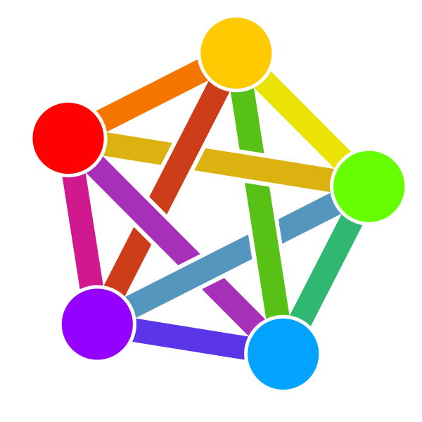
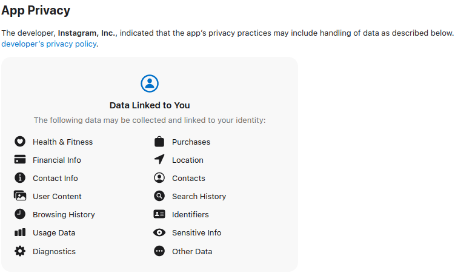

# 202307\_01\_Threads-The-Intersection-of-social-media-and-the-Fediverse.

If we must choose one word that defines what has been going on during this week, it is "Threads." The new product from Meta and Instagram, Threads, has garnered attention with its [similarities](https://www.reuters.com/technology/twitter-is-threatening-sue-meta-over-threads-semafor-2023-07-06/) to Twitter and its integration with the popular social media platform. As professionals in the digital space, it's essential to understand the implications and opportunities presented by this new offering.

<figure><figcaption>
Instagram's Threads.
</figcaption></figure>

Threads allow users to share messages up to 500 characters, along with links, photos, and videos up to 5 minutes in length. What sets Threads apart is its connection to the "Protocol," as mentioned in its [Terms of Use](https://help.instagram.com/769983657850450) (ToU). The Protocol is described as:

> an interoperable protocol that allows social networking and other services to interface with a network of servers to facilitate the exchange of content and information between the users of such servers and interfaces. For clarity, the Protocol is not part of the Threads Service or Instagram.

While not explicitly named the “Protocol”, it is widely believed to be the [ActivityPub](https://activitypub.rocks/) protocol, which is a fundamental element of the decentralized federated universe known as the Fediverse.

<figure><figcaption>
The Fediverse logo.
</figcaption></figure>

 

ActivityPub, which powers Mastodon and other Fediverse applications, would [enable](https://about.fb.com/news/2023/07/introducing-threads-new-app-text-sharing/) the Threads Service to connect with third-party servers and share content seamlessly. This interoperability opens new possibilities for users and content creators, allowing them to interact and exchange data across different platforms.

However, the integration of Threads with the Fediverse raises concerns regarding data privacy and revenue models. Meta's primary revenue stream is advertising, and user data plays a significant role in generating targeted ads. Considering this, the Digital Markets Act (DMA) in Europe temporarily halted the release of Threads within the European Union. The DMA restricts the combination of personal data across platforms, presenting a challenge for Meta's entry into the European market.

The contrasting data requirements between Threads and Mastodon have sparked numerous discussions. While Threads relies on user data for advertising purposes, Mastodon instances operate on different models. Some are donation-based, while others offer paid versions with enhanced features. The revenue model's divergence is a key factor contributing to the varying data collection practices between these two applications.

<figure><figcaption>
Threads iOS App Privacy.
</figcaption></figure>

<figure><figcaption>
Mastodon iOS App Privacy.
</figcaption></figure>

It's important to note that when Threads connects with third-party services in the Fediverse, it assumes limited liability and moderation power over the content originating from those services. In contrast, platforms like Mastodon provide administrators with extensive moderation tools and the ability to de-federate servers to ensure the network's integrity.

In conclusion, Threads presents itself as a hybrid platform, combining aspects of Twitter and Mastodon. It offers unique features but falls short of Twitter's flexibility and Mastodon's decentralization and interoperability. Once Threads is fully integrated into the Fediverse, we'll witness its impact on the ecosystem and its potential to revolutionize decentralized technologies.

As professionals in this field, we appreciate any advancements that bring new functionalities and capabilities to decentralized platforms. However, it's crucial to recognize that Meta stands to gain a vast user base and content repository, enhancing their marketing and advertising capabilities. We must stay vigilant about data privacy and ensure that the benefits of decentralized technologies outweigh potential challenges.
