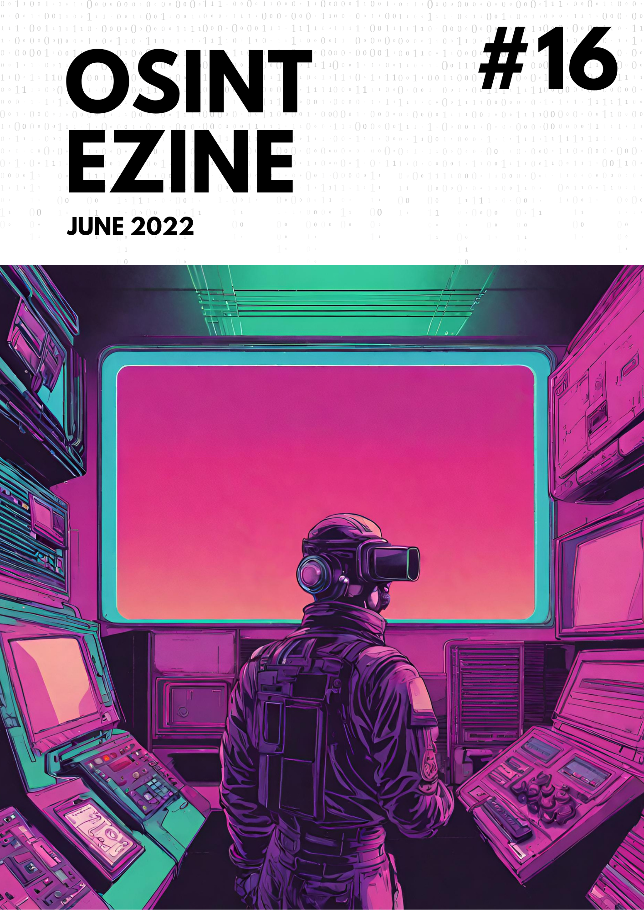

# 06 - June 2022

<figure><figcaption></figcaption></figure>

Welcome to the June issue of the OSINT eZine (_#16_). I want to remind to all the readers a little detail about this newsletter, every release contains only news released during the month, June in the case of this one, and only tools released or updated also in the month. Now after this little disclaimer... this number includes topics such as a tool to search usernames in more than 131 platforms; an addon to capture an entire webpage; browser extensions fingerprinting; a report analyzing the alt-platform Gab; the foundation of the Metaverse Standards Forum... and much more!

Hey Ho, Lets Go!:

* [Addons: **GoFullPage. Chrome addon to capture an entire Webpage.**](06-june-2022.md#addons-gofullpage.-chrome-addon-to-capture-an-entire-webpage)
* [Diversity: **Bias free and inclusive documentation drafting.**](06-june-2022.md#diversity-bias-free-and-inclusive-documentation-drafting)
* [News: **Ukraine Cyber Operations resources.**](06-june-2022.md#news-ukraine-cyber-operations-resources)
* [Privacy: **Extensions fingerprint.**](06-june-2022.md#privacy-extensions-fingerprint)
* [Techniques: **Browser-based messenger OSINT techniques.**](06-june-2022.md#techniques-browser-based-messenger-osint-techniques)
* [Techniques: **Dynamics on alt-platform Gab.**](06-june-2022.md#techniques-dynamics-on-alt-platform-gab)
* [Tools: **Blackbird. Usernames across 131 platforms.**](06-june-2022.md#tools-blackbird.-usernames-across-131-platforms)
* [Tools: **Extract.pics.**](06-june-2022.md#tools-extract.pics)
* [Web3: **The creation of the&#x20;**~~**First Galactic Empire**~~**&#x20;Metaverse Standards Forum.**](06-june-2022.md#web3-the-creation-of-the-first-galactic-empire-metaverse-standards-forum)

***

### Addons: GoFullPage. Chrome addon to capture an entire Webpage.

This Chrome addon allows you to make an screenshot of the entire Webpage instead of the upper section that most of the tools of its kind does.

[https://gofullpage.com/](https://gofullpage.com/) 

***

### Diversity: Bias free and inclusive documentation drafting.

Microsoft technology reaches every part of the globe, so it's critical that all our communications are inclusive and diverse.

[https://docs.microsoft.com/en-us/style-guide/bias-free-communication](https://docs.microsoft.com/en-us/style-guide/bias-free-communication) [https://developers.google.com/style/inclusive-documentation](https://developers.google.com/style/inclusive-documentation) 

***

### News: Ukraine Cyber Operations resources.

Curated Intelligence is working with analysts from around the world to provide useful information to organizations in Ukraine looking for additional free threat intelligence.

[https://github.com/curated-intel/Ukraine-Cyber-Operations](https://github.com/curated-intel/Ukraine-Cyber-Operations) 

***

### Privacy: Extensions fingerprint.

Another resource to check our fingerprint online, this time for Chrome browsers. The project creator explains that Chrome extensions can be detected by fetching their web accessible resources. These are files inside an extension that can be accessed by web pages. The detected extensions can be used to track you through browser fingerprinting.

[https://z0ccc.github.io/extension-fingerprints/](https://z0ccc.github.io/extension-fingerprints/) [https://github.com/z0ccc/extension-fingerprints](https://github.com/z0ccc/extension-fingerprints) 

***

### Techniques: Browser-based messenger OSINT techniques.

A technical explanation and tutorial on how to extract content from browser-based messenger platforms like Telegram with several tips, tricks and resources to access API content.

[https://vimeo.com/video/713837340/76e726e412](https://vimeo.com/video/713837340/76e726e412) 

***

### Techniques: Dynamics on alt-platform Gab.

A new report from Stanford's Internet Observatory where they made an in-depth analysis of Gab platform. It contains information such as highly shared domains, user analysis, statistics and much more:

[https://purl.stanford.edu/ns280ry2029](https://purl.stanford.edu/ns280ry2029) 

***

### Tools: Blackbird. Usernames across 131 platforms.

Blackbird is an OSINT tool written in Python to search fast for accounts by username across 131 sites. It provides a CLI (command-line interface) version and also an integrated web server option.

[https://github.com/p1ngul1n0/blackbird](https://github.com/p1ngul1n0/blackbird) 

***

### Tools: Extract.pics.

This is an interesting online service that claims to retrieve all the images from a given URL using a virtual machine. It is a good alternative when you are working in an environment where you can not install addons or when you need a third party collecting the data on your behalf.

[https://extract.pics/](https://extract.pics/) 

***

### Web3: The creation of the ~~First Galactic Empire~~ Metaverse Standards Forum.

The biggest companies working on different tech fields, from chip makers to gaming companies, have joined together to create the ~~First Galactic Empire~~ Metaverse Standards Forum. The idea is to tackle the issue of interoperability developing the future of standards to provide compatibility between companies. Meta, Microsoft, NVIDIA are ones of the names (Apple is not yet affiliated)as well as established standards-setting bodies like the World Wide Web Consortium (W3C).

[https://metaverse-standards.org/](https://metaverse-standards.org/) 

***

_Bitcoin may be the TCP/IP of money._

_\~Paul Buchheit, creator of Gmail._
