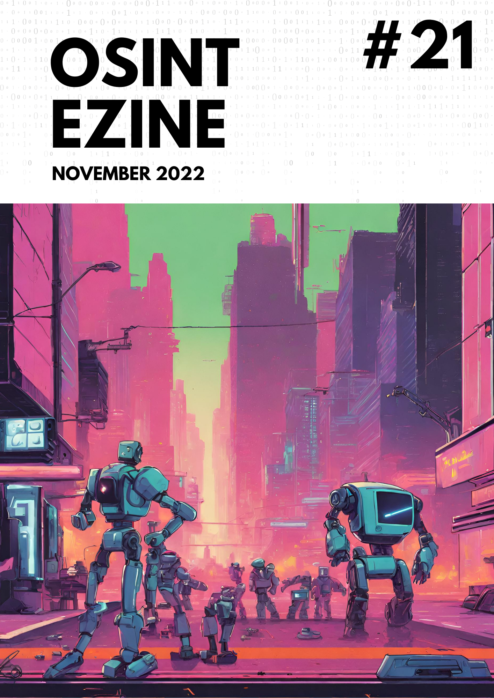

# 11 - November 2022

<figure><figcaption></figcaption></figure>

Welcome to the November issue of the OSINT eZine (_#21_), this number includes topics such as NFTs on Instagram; an addon to detect fake profile pictures; Metamask collecting user’s IPs; an OSINT tool for Mastodon; protect your iPhone with the new Lockdown mode; learning resources about cryptography; a 101 on Mastodon... and much more!

Hey Ho, Lets Go!:

* [Addons: **Fake profile picture detector.**](11-november-2022.md#addons-fake-profile-picture-detector)
* [Crypto: **Instagram ready for NFTs on Polygon.**](11-november-2022.md#crypto-instagram-ready-for-nfts-on-polygon)
* [Learn: **Fundamentals of cryptography for OSINT.**](11-november-2022.md#learn-fundamentals-of-cryptography-for-osint)
* [Learn: **What even is Mastodon?**](11-november-2022.md#learn-what-even-is-mastodon)
* [News: **How humans may look in the year 3000.**](11-november-2022.md#news-how-humans-may-look-in-the-year-3000)
* [Privacy: **Apple’s Lockdown mode.**](11-november-2022.md#privacy-apples-lockdown-mode)
* [Privacy: **Metamask IP and ETH data collection.**](11-november-2022.md#privacy-metamask-ip-and-eth-data-collection)
* [Tools: **Exiv2, metadata extractor.**](11-november-2022.md#tools-exiv2-metadata-extractor)
* [Tools: **Masto, Mastodon OSINT tool.**](11-november-2022.md#tools-masto-mastodon-osint-tool)
* [Tools: **SNScrape. Social Network Services scraper.**](11-november-2022.md#tools-snscrape.-social-network-services-scraper)

***

### Addons: Fake profile picture detector.

This extension for Chrome, checks whether a profile picture can be fake and gives a score about the probability. It is very useful when investigating accounts that can belong to a bot creator or fake users:

[https://chrome.google.com/webstore/detail/fake-profile-detector-dee/jbpcgcnnhmjmajjkgdaogpgefbnokpcc?hl=en-US](https://chrome.google.com/webstore/detail/fake-profile-detector-dee/jbpcgcnnhmjmajjkgdaogpgefbnokpcc?hl=en-US) 

***

### Crypto: Instagram ready for NFTs on Polygon.

An update from their announcement in May, Meta is going to use Polygon to enable users to create and interact with NFTs. Also SOLANA is added to the previous list of blockchains supported.

[https://about.fb.com/news/2022/05/introducing-digital-collectibles-to-showcase-nfts-instagram](https://about.fb.com/news/2022/05/introducing-digital-collectibles-to-showcase-nfts-instagram) 

***

### Learn: Fundamentals of cryptography for OSINT.

A primer on cryptography. This article covers fundamentals on different applications of cryptography for OSINT, including the use of hidden content with techniques such as steganography.

[https://www.dutchosintguy.com/post/cryptography-osint-the-fundamentals](https://www.dutchosintguy.com/post/cryptography-osint-the-fundamentals) 

***

### Learn: What even is Mastodon?

A detailed explanation about what Mastodon is and how it looks like. Very useful for all the new users and investigators that want to approach the platform for the first time. This eZine includes also a tool to perform investigations on Mastodon, check it out in the Tools section.

[https://www.domaintools.com/resources/blog/the-move-to-mastodon-tips-and-tricks/](https://www.domaintools.com/resources/blog/the-move-to-mastodon-tips-and-tricks/) 

***

### Privacy: Apple’s Lockdown mode.

A new functionality available on iOS 16 that pursues "to protect devices against extremely rare and highly sophisticated cyber attacks". It is a mode that changes several setting on the phone in order to avoid common attack surfaces like receiving messages with content from unknown senders, FaceTime unknown calls, some device connection protection mechanisms and additional security settings:

[https://support.apple.com/en-us/HT212650](https://support.apple.com/en-us/HT212650) 

***

### Privacy: Metamask IP and ETH data collection.

Consensys, the company behind Metamask crypto wallet application, has updated their privacy policy and from now on they are collecting the IP addresses and the ETH addresses of the users of the application when using Infura.io (also owned by Consensys) as RPC endpoint. In my opinion, when using this kind of applications I assume that some identifiers, as IPs, user-agents, etc... are shared with the companies so this is not a surprise for me, the only solution (as always with crypto), run your own node ;) .

[https://consensys.net/privacy-policy/](https://consensys.net/privacy-policy/) 

***

### News: How humans may look in the year 3000.

A very interesting study about how humans may look like in the year 3000 based in our use of current technology.

[https://www.dailymail.co.uk/sciencetech/article-11385935/Grotesque-model-Mindy-reveals-humans-look-like-thanks-reliance-technology.html](https://www.dailymail.co.uk/sciencetech/article-11385935/Grotesque-model-Mindy-reveals-humans-look-like-thanks-reliance-technology.html) 

***

### Tools: Exiv2, metadata extractor.

When talking about metadata, exiftool is the tool-to-go, it is very good and gives nice results but I have found also exiv2 as a complementary tool, as it was able in some cases to provide additional information not available to exfiftool.

[https://exiv2.org/download.html](https://exiv2.org/download.html) 

***

### Tools: Masto, Mastodon OSINT tool.

With the controversy of Elon Musk new changes to Twitter, Mastodon seems to live a second chance and it's user-base is increasing daily, Masto is a Python tool to gather intelligence on users and instances:

[https://github.com/C3n7ral051nt4g3ncy/Masto](https://github.com/C3n7ral051nt4g3ncy/Masto) 

***

### Tools: SNScrape. Social Network Services scraper.

SNScrape is a scraper for social networking services (SNS). It scrapes items like user profiles, hashtags, or searches and returns the discovered items, e.g. the relevant posts. It works for multiple platforms like Facebook, Mastodon, Reddit, Twitter, Telegram...

[https://github.com/JustAnotherArchivist/snscrape](https://github.com/JustAnotherArchivist/snscrape) 

***

_Wealth is two things:_

* _your phone has no case_
* _your bed touches no walls_

_\~0xgaut, Crypto entrepreneur._
