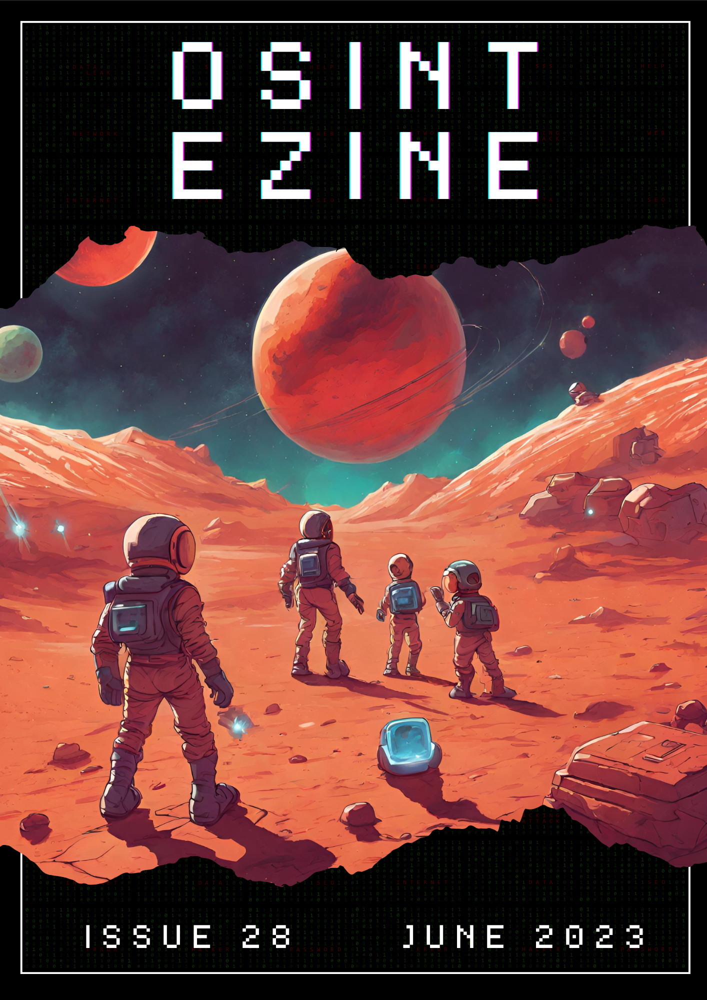

# 06 - June 2023

<figure><figcaption></figcaption></figure>

Welcome to the June issue of the OSINT eZine (_#28_), this number includes topics such as identifying whether an image is AI generated; NFTs used by extremists; Military use of OSINT techniques; A report on Cybersecurity and Artifficial Intelligence research... and much more!

Hey Ho, Lets Go!:

* [AI: **AI or Not.**](06-june-2023.md#ai-ai-or-not)
* [AI: **Artificial Intelligence and Cybersecurity Research.**](06-june-2023.md#ai-artificial-intelligence-and-cybersecurity-research)
* [AI: **What ChatGPT Can and Can't Do for Intelligence.**](06-june-2023.md#ai-what-chatgpt-can-and-cant-do-for-intelligence)
* [Crypto: **Ethereum Raw Transaction Decoder.**](06-june-2023.md#crypto-ethereum-raw-transaction-decoder)
* [Crypto: **Etherscan Tools.**](06-june-2023.md#crypto-etherscan-tools)
* [Crypto: **Extremist NFTs Across Blockchains.**](06-june-2023.md#crypto-extremist-nfts-across-blockchains)
* [Privacy: **JutsDeleteMe.**](06-june-2023.md#privacy-justdeleteme)
* [Privacy: **Make 12 Words The Standard.**](06-june-2023.md#privacy-make-12-words-the-standard)
* [Techniques: **Military Intelligence Using OSINT Methods.**](06-june-2023.md#techniques-military-intelligence-using-osint-methods)
* [Techniques: **Social Search Techniques, LinkedIn.**](06-june-2023.md#techniques-social-search-techniques-linkedin)
* [Tools: **Hitomi Downloader.**](06-june-2023.md#tools-hitomi-downloader)
* [Tools: **WhatMail.**](06-june-2023.md#tools-whatmail)
* [Tools: **WhatsMyName - Maltego.**](06-june-2023.md#tools-whatsmyname-maltego)

***

### AI: AI or Not.

If you need to determine whether an image has been generated by artificial intelligence or a human, this website will allow you to try to identify it. It supports several sources such as images generated by _Stable Diffusion_, _MidJourney_ or _DALL-E_.

[https://www.aiornot.com/](https://www.aiornot.com/) 

***

### AI: Artificial Intelligence and Cybersecurity Research.

The European Union Agency For Cybersecurity (ENISA) published an study that identifies the needs for research on AI for cybersecurity and on securing AI. This report present the results of the work carried out in 2021 and subsequently validated in 2022 and 2023 with stakeholders, experts and community members such as the ENISA AHWG on Artificial Intelligence.

[https://www.enisa.europa.eu/publications/artificial-intelligence-and-cybersecurity-research](https://www.enisa.europa.eu/publications/artificial-intelligence-and-cybersecurity-research) 

***

### AI: What ChatGPT Can and Can't Do for Intelligence.

The possible use and benefits of Large Language Models (LLMs) such as ChatGPT is a topic that every sector or industry is exploring. This article explores some possible uses of ChatGPT, how it exhibits both impressive capabilities and limitations, potentially reshaping aspects of intelligence analysis while requiring careful exploration of its potential downsides and risks.

[https://www.lawfareblog.com/what-chatgpt-can-and-cant-do-intelligence](https://www.lawfareblog.com/what-chatgpt-can-and-cant-do-intelligence) 

***

### Crypto: Ethereum Raw Transaction Decoder.

Decode Ethereum-based raw transactions with ease using this powerful website. Supports both EIP-1559 and legacy transactions for complete compatibility. Get valuable insights into transaction details, including sender and recipient addresses, gas price, nonce, signature and more.

[https://rawtxdecode.in/](https://rawtxdecode.in/) 

***

### Crypto: Etherscan tools.

Etherscan is an exceptional blockchain explorer that offers free access to a wealth of resources and information. They've recently added a Tools section where you can conveniently check address balances or export data in bulk, making it even more valuable for users.

[https://etherscan.io/balancecheck-tool](https://etherscan.io/balancecheck-tool) [https://etherscan.io/exportData](https://etherscan.io/exportData) 

***

### Crypto: Extremist NFTs Across Blockchains.

The abuse of emerging technologies such as NFTs and other crypto-assets is one of my fields of expertise and also, a topic that attracts a lot of attention. Louis Jarvers, a well-experienced OSINT investigator discuss in this article about his findings on threats involving Web3 technologies, from terrorism and ogranized crime to money laundering, scams or child sexual abuse material.

[https://www.lawfareblog.com/extremist-nfts-across-blockchains](https://www.lawfareblog.com/extremist-nfts-across-blockchains) 

***

### Privacy: JustDeleteMe.

A simple but very useful directory with hundreds of links that aims to be a directory of URLs to enable you to easily delete your account from web services. Using a color pattern to determine the difficulty to remove your data from a service, it is an updated repository were you can search for a service and the website will display the direct link to delete your account and how difficult the process will be.

[https://backgroundchecks.org/justdeleteme/](https://backgroundchecks.org/justdeleteme/) 

***

### Privacy: Make 12 words the standard.

What is safer, 12 or 24 words? In the crypto space, it is a common approach the use of seed phrases to store different valuable information. This blog post challenges the commonly held belief that longer seed phrases enhance Bitcoin security, arguing that it unnecessarily burdens users without significant real-world benefits. It advocates for adopting 12 word seed phrases as the standard, highlighting the broader aspects of private key security in Bitcoin.

[https://foundationdevices.com/2023/06/make-12-words-the-standard/](https://foundationdevices.com/2023/06/make-12-words-the-standard/) 

***

### Techniques: Military intelligence using OSINT methods.

As practice shows, modern armed conflicts require new approaches to organizing the collection and analysis of open data, which we operate within the framework of OSINT. In this article, the author looks at various tools that can be used in the context of frontline reconnaissance and the collection of information about what is happening in the war zone from open sources.

[https://medium.com/@ibederov\_en/military-intelligence-using-osint-methods-4aae1df2d812](https://medium.com/@ibederov_en/military-intelligence-using-osint-methods-4aae1df2d812) 

***

### Techniques: Social Search Techniques, LinkedIn.

LinkedIn is a social media platform that sometimes provides unexpected results. It is very common to see cases were people has presence on this media providing investigators with new or enhance information. This post by the OSINT expert Henk Van Ess is the first of a series of articles sharing some techniques about how to perform some advanced tricks, in this case, on LinkedIn.

[https://gijn.org/2023/06/27/social-search-techniques-guide-using-linkedin-henk-van-ess/](https://gijn.org/2023/06/27/social-search-techniques-guide-using-linkedin-henk-van-ess/) 

***

### Tools: Hitomi Downloader.

A simple but very powerful tool that allows users to download images/videos/music/text from various websites. It covers a wide amount of websites and also, provides the possibility to have a Chrome Extension as well.

[https://github.com/KurtBestor/Hitomi-Downloader](https://github.com/KurtBestor/Hitomi-Downloader) 

***

### Tools: WhatMail.

WhatMail is a command-line tool that analyzes the header of an email and provides detailed information about various fields. It extracts commonly recognized email header fields and it is useful for forensic analysis investigating email authenticity understanding email routing and gathering information about the email sender and recipient. The output is presented in a tabular format making it easy to read and analyze.

[https://github.com/z0m31en7/WhatMail](https://github.com/z0m31en7/WhatMail) 

***

### Tools: WhatsMyName - Maltego.

When investigating usernames, _whatsmyname.app_ is one of the most used resources in order to identify a user in a platform. For the ones that use Maltego on a daily basis, this transform integrates the possibility to use the mentioned platform in order to perform different searches from Maltego.

[https://github.com/TURROKS/Maltego\_WhatsMyName](https://github.com/TURROKS/Maltego_WhatsMyName) 

***

_Technology is not just about gadgets and algorithms; it's about empowering humanity to shape a better future._

_\~Reshma Saujani, American lawyer and founder of "Girls Who Code"._
