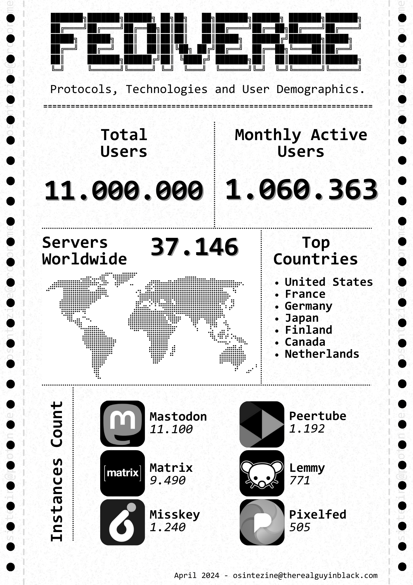

# 04 - April 2024

<figure><figcaption></figcaption></figure>

Welcome to the April issue of the OSINT eZine (_#38_), this number includes topics such as an infographic about the Fediverse; an academic research on malicious smart contracts; bad operational security mistakes; MetaAI's Llama 3; a tool to check online for usernames; Telegram blockchain (TON) implementing palm recognition; Meta's deepfake detection; online porn restrictions and VPNs; the Bitcoin halving; online maps of GPS jammed areas; Obsidian and NLP; a report on EU criminal networks; techniques to avoid crypto recovery services scams; a report on blockchain-based virtual worlds; the videos from the SANS OSINT summit; mistakes when performing OSINT... and much more!&#x20;

Hey Ho, Lets Go!:

* [AI: **Developing Rapidly With Generative AI.**](04-april-2024.md#ai-developing-rapidly-with-generative-ai)
* [AI: **Meta Llama 3.**](04-april-2024.md#ai-meta-llama-3)
* [Crypto: **Bitcoin Halving.**](04-april-2024.md#crypto-bitcoin-halving)
* [Crypto: **Reputation Oracles, Crypto & AI.**](04-april-2024.md#crypto-reputation-oracles-crypto-and-ai)
* [Infographic: **Fediverse Status.**](04-april-2024.md#infographic-fediverse-status)
* [Learning: **MITRE Post-Attack Lessons Learned.**](04-april-2024.md#learning-mitre-post-attack-lessons-learned)
* [Learning: **SANS OSINT Summit 2024.**](04-april-2024.md#learning-sans-osint-summit-2024)
* [News: **Countries by Cybercrime Threat Level.**](04-april-2024.md#news-countries-by-cybercrime-threat-level)
* [News: **FBI Internet Crime Report.**](04-april-2024.md#news-fbi-internet-crime-report)
* [News: **Meta Launches Deepfake Detection.**](04-april-2024.md#news-meta-launches-deepfake-detection)
* [News: **Online Porn Restrictions Leading to a VPN Boom.**](04-april-2024.md#news-online-porn-restrictions-leading-to-a-vpn-boom)
* [News: **XZ Controversy, Matrix and Open Source Philosophy.**](04-april-2024.md#news-xz-controversy-matrix-and-open-source-philosophy)
* [Privacy: **Telegram Plans to Implement Palm Recognition.**](04-april-2024.md#privacy-telegram-plans-to-implement-palm-recognition)
* [Privacy: **X Defying Brazil's Censorship.**](04-april-2024.md#privacy-x-defying-brazils-censorship)
* [Techniques: **EU Criminal Networks.**](04-april-2024.md#techniques-eu-criminal-networks)
* [Techniques: **Crypto Recovery Scams Unveiled.**](04-april-2024.md#techniques-crypto-recovery-scams-unveiled)
* [Techniques: **Israeli Bad Opsec.**](04-april-2024.md#techniques-israeli-bad-opsec)
* [Techniques: **Obsidian and NLP.**](04-april-2024.md#techniques-obsidian-and-nlp)
* [Techniques: **Seven Deadly Sins of Bad Open Source Research.**](04-april-2024.md#techniques-seven-deadly-sins-of-bad-open-source-research)
* [Tools: **Chiasmodon.**](04-april-2024.md#tools-chiasmodon)
* [Tools: **Emora, Username Enumeration.**](04-april-2024.md#tools-emora-username-enumeration)
* [Tools: **GPSJam.**](04-april-2024.md#tools-gpsjam)
* [Tools: **PageXray.**](04-april-2024.md#tools-pagexray)
* [Web3: **Blockchain-Enabled Virtual Worlds.**](04-april-2024.md#web3-blockchain-enabled-virtual-worlds)

***

### AI: Developing Rapidly With Generative AI.

Generative AI has made significant strides in recent years, offering innovative solutions to user problems. Discord published a blog post sharing insights on leveraging large language models (LLMs) for feature development. The process involves stages such as product ideation, defining requirements, prototyping, and full-scale deployment. By identifying use cases, considering latency, task complexity, prompt length, quality, safety, and language support, developers can harness generative AI effectively. The goal is to rapidly launch new features while ensuring optimal performance and user satisfaction

[https://discord.com/blog/developing-rapidly-with-generative-ai](https://discord.com/blog/developing-rapidly-with-generative-ai)\

***

### AI: Meta Llama 3.

MetaAI shared it's newest version of its open-source AI model, Llama. I have the opportunity to test it (8B) in a regular laptop before writing this eZine and I am very impressed on how well it performed in domestic hardware. This model evaluates better, duplicating its performance some times, to other well-known models such as Mistral 7B Instruct. Soon we will discover how other developments implement Llama 3 as foundation to build awesome new programs. As a remark, most of this kind of models achieve the better results when using English as the main prompt language.

[https://ai.meta.com/blog/meta-llama-3/](https://ai.meta.com/blog/meta-llama-3/)\

***

### Crypto: Bitcoin Halving.

The fourth Bitcoin halving, a significant event in the cryptocurrency world, has occurred during this month. This event, which happens approximately every four years (or every 210.000 blocks), will see the reward for mining new blocks halve from the current 6.25 bitcoins to 3.125 bitcoins. The halving mechanism is a key feature of Bitcoin’s design, intended to control inflation by reducing the rate at which new bitcoins are introduced into circulation.

[https://www.coindesk.com/learn/bitcoin-halving-explained/](https://www.coindesk.com/learn/bitcoin-halving-explained/)\

***

### Crypto: Reputation Oracles, Crypto & AI.

Is it possible to programmatically identify malicious smart contracts solely on the basis of their code? On this paper the authors explain the methodology used to answer this question and some impressive results. Blockchain technologies are the perfect playgrounds for AI developments on data analysis.

[https://research.portexai.com/reputation-oracles/](https://research.portexai.com/reputation-oracles/)\

***

### Infographic: Fediverse Status.

This month, attached to this eZine, you can find an infographic that I have created about the current status of the "Fediverse" in this first third of the year. The term comes from the union of "Federation" and "Universe" and encompasses different platforms and services under the same family of protocols, being Mastodon, the most famous one. In the infographic you can see updated information such as the amount of total users, the countries that host most of the infrastructure or how many servers (instances) has the top 6 platforms.

<figure><figcaption></figcaption></figure>

***

### Learning: MITRE Post-Attack Lessons Learned.

MITRE, a company that strives to maintain the highest cybersecurity possible, is not immune to cyberattacks either. MITRE was subject to an intrusion into one of their research and prototyping networks and in this blog post the incident is covered in detail.

[https://medium.com/mitre-engenuity/advanced-cyber-threats-impact-even-the-most-prepared-56444e980dc8](https://medium.com/mitre-engenuity/advanced-cyber-threats-impact-even-the-most-prepared-56444e980dc8)\

***

### Learning: SANS OSINT Summit 2024.

For the ones who cannot attend the SANS OSINT summit that took place recently, they have uploaded to YouTube several talks and presentation covering different topics such as extracting TikTok data; hunting online ads; Telegram tips and much more.

[https://www.youtube.com/playlist?list=PLs4eo9Tja8bi1RZyKT\_HlN48QLIRW6HhG](https://www.youtube.com/playlist?list=PLs4eo9Tja8bi1RZyKT\_HlN48QLIRW6HhG)\

***

### News: Countries by Cybercrime Threat Level.

Following three years of intensive research, an international team of researchers have compiled the first ever ‘World Cybercrime Index’, which identifies the globe’s key cybercrime hotspots by ranking the most significant sources of cybercrime at a national level.

[https://www.ox.ac.uk/news/2024-04-10-world-first-cybercrime-index-ranks-countries-cybercrime-threat-level](https://www.ox.ac.uk/news/2024-04-10-world-first-cybercrime-index-ranks-countries-cybercrime-threat-level)\

***

### News: FBI Internet Crime Report.

The Federal Bureau of Investigation’s Internet Crime Complaint Center (IC3) recently released its annual Internet Crime Report. The report offers critical insights into the cyber threat landscape based on aggregated data from complaints reported during the last calendar year.

[https://www.fbi.gov/contact-us/field-offices/sanfrancisco/news/fbi-releases-internet-crime-report](https://www.fbi.gov/contact-us/field-offices/sanfrancisco/news/fbi-releases-internet-crime-report)\

***

### News: Meta Launches Deepfake Detection.

Beginning in May, Meta will implement updated guidelines for AI-created and altered media. The company plans to introduce broader labeling of this content, which will include the addition of a “Made with AI” marker on deepfake materials. Moreover, Meta will provide extra context for edits that could significantly mislead people on critical matters

[https://about.fb.com/news/2024/04/metas-approach-to-labeling-ai-generated-content-and-manipulated-media/](https://about.fb.com/news/2024/04/metas-approach-to-labeling-ai-generated-content-and-manipulated-media/)\

***

### News: Online Porn Restrictions Leading to a VPN Boom.

New internet laws, requiring age verification for porn and social media, may be contributing to a surge in VPN adoption, experts say. I will cover the topic entirely in an article but regulators are pushing users to adopt broadly the use of VPNs and I foresee its restriction, regulation and possible ban in a not distant future.

[https://www.popsci.com/technology/vpn-boom/](https://www.popsci.com/technology/vpn-boom/)\

***

### News: XZ Controversy, Matrix and Open Source Philosophy.

During this month, the world was shocked by the discovery of a backdoor in one of the most used Linux programs for remote access to systems, SSH. Free and open source software (FOSS) is the basis of almost all the technology we used nowadays. from WhatsApp to Signal, from iOS to Android, all open source software mainly developed by coders around the world that do that for fun, as a hobby. We should give FOSS the relevance it has and the decentralized protocol Matrix on its blog, make a firm statement about how governments and organizations should publicly found this kind of software so we can avoid issues, attacks and societal impacts by software that all of us use everyday.

[https://matrix.org/blog/2024/04/open-source-publicly-funded-service/](https://matrix.org/blog/2024/04/open-source-publicly-funded-service/) [https://openssf.org/blog/2024/04/15/open-source-security-openssf-and-openjs-foundations-issue-alert-for-social-engineering-takeovers-of-open-source-projects/](https://openssf.org/blog/2024/04/15/open-source-security-openssf-and-openjs-foundations-issue-alert-for-social-engineering-takeovers-of-open-source-projects/)\

***

### Privacy: Telegram Plans to Implement Palm Recognition.

TON Society, the blockchain based on Telegram, has partnered with an AI company, HumanCode.ai providing 5 million dollars of funds to develop a proof-of-personhood mechanism to verify Telegram users identity by using biometric data obtained from images of the palms of the hands. Biometrics, blockchain and AI is a trifecta that give me goosebumps after my researches on Worldcoin.

[https://blog.ton.org/human-code-brings-ai-powered-biometrics-to-ton-ecosystem](https://blog.ton.org/human-code-brings-ai-powered-biometrics-to-ton-ecosystem)\

***

### Privacy: X Defying Brazil's Censorship.

Elon Musk said on the platform that the company had decided to lift all restrictions on Brazilian accounts targeted by an order from the nation’s Supreme Court. This is a very important step linked to the previous article shared about regulating of porn sites. Censorship, even in a legal way, is starting to be imposed on different means currently and the use of circumvent technologies such as VPNs; Proxies or mixnets are on-demand. What would be the consequences if the general public adopt them widely?

[https://www.zerohedge.com/political/elon-musk-says-x-will-defy-order-brazils-supreme-court-after-twitter-files](https://www.zerohedge.com/political/elon-musk-says-x-will-defy-order-brazils-supreme-court-after-twitter-files)\

***

### Techniques: EU Criminal Networks.

A new report by Europol delves into the inner workings of the criminal networks that pose the highest threat to the EU’s security. The report describes, in detail, how the most threatening criminal networks are organized, which criminal activities they engage in, and how and where they operate. The report also assesses which specific characteristics the criminal networks hold that increase the threat to the EU’s internal security. All EU Member States and 17 of Europol’s partner countries contributed data to identify the most threatening criminal networks in Europe. This resulted in a unique dataset of 821 most threatening criminal networks, with extensive information on all aspects that describe them and help assess their threat.

[https://www.europol.europa.eu/publication-events/main-reports/decoding-eus-most-threatening-criminal-networks](https://www.europol.europa.eu/publication-events/main-reports/decoding-eus-most-threatening-criminal-networks)\

***

### Techniques: Crypto Recovery Scams Unveiled.

A very interesting article about how "crypto recovery services" turn into scams. The post details some common approaches taken to scam the users and some mitigation measures that can be taken in order to avoid be a victim of this trendy platforms.

[https://www.linkedin.com/pulse/mia-singh-quoin-vs-recovery-scammers-hands-on-scams-tara-annison-63ehe](https://www.linkedin.com/pulse/mia-singh-quoin-vs-recovery-scammers-hands-on-scams-tara-annison-63ehe)\

***

### Techniques: Israeli Bad Opsec.

The identity of the commander of Israel’s Unit 8200 is a closely guarded secret. He occupies one of the most sensitive roles in the military, leading one of the world’s most powerful surveillance agencies, comparable to the US National Security Agency. An embarrassing security lapse is linked to a book he published on Amazon, which left a digital trail to a private Google account created in his name, along with his unique ID and links to the account’s maps and calendar profiles.

[https://www.theguardian.com/world/2024/apr/05/top-israeli-spy-chief-exposes-his-true-identity-in-online-security-lapse](https://www.theguardian.com/world/2024/apr/05/top-israeli-spy-chief-exposes-his-true-identity-in-online-security-lapse)\

***

### Techniques: Obsidian and NLP.

Obsidian is one of the most powerful tools in my arsenal. From my OSINT bookmarks to crypto RegEx (regular expressions); from methodology to resources, Obsidian carries the heavy weight of be the central repository with regards operational knowledge. This article showcases some functionalities and uses such as combining it with Natural Language Processing (NLP) techniques.

[https://medium.com/@farallon/uncommon-osint-obsidian-semantic-meaning-and-nlp-3339e1e51d70](https://medium.com/@farallon/uncommon-osint-obsidian-semantic-meaning-and-nlp-3339e1e51d70)\

***

### Techniques: Seven Deadly Sins of Bad Open Source Research.

From the war in Ukraine to the conflict in Gaza, in the last years we have spotted an increase usage and misuse of the term OSINT. Self-acclaimed OSINT experts, groups of open source analysts, dedicated social media channels to OSINT... the analysis and production of intelligence in open sources is a discipline that is gaining traction and use in multiple areas but, with great power comes great responsibility. In this article, Bellingcat exposes several mistakes when conducting OSINT that can lead to total failures and how to avoid them.

[https://www.bellingcat.com/resources/2024/04/25/oshit-seven-deadly-sins-of-bad-open-source-research/](https://www.bellingcat.com/resources/2024/04/25/oshit-seven-deadly-sins-of-bad-open-source-research/)\

***

### Tools: Chiasmodon.

Chiasmodon is an OSINT tool designed to assist in the process of gathering information about a target domain. Its primary functionality revolves around searching for domain-related data, including domain emails, domain credentials, CIDRs , ASNs , and subdomains.

[https://github.com/chiasmod0n/chiasmodon](https://github.com/chiasmod0n/chiasmodon)\

***

### Tools: Emora, Username Enumeration.

Emora is an OSINT tool like [sherlock](https://github.com/sherlock-project/sherlock), which can find out on which sites a username is claimed or not.

[https://github.com/Prescoter/Emora-Project](https://github.com/Prescoter/Emora-Project)\

***

### Tools: GPSJam.

This online service provides accurate and updated information about GPS coverage shortage across the world. The data is obtained from different open sources broadcast by aircrafts. The map view allows to know in real-time if a certain region is being jammed or there are issues, just take a look at the Baltics and you will find out.

[https://gpsjam.org/](https://gpsjam.org/)\

***

### Tools: PageXray.

This online service creates an entire report about any website you enter as input. It extracts relevant information such as advertising information; external and internal links; a screenshot of the landing page; domain information and other fields. Take into account that this is an external service and there is no policy or disclaimer on how they use the data you enter in their service.

[https://pagexray.fouanalytics.com/](https://pagexray.fouanalytics.com/)\

***

### Web3: Blockchain-Enabled Virtual Worlds.

The Metaverse hype has fade out and artificial intelligence has taken over. I am a truly believer that virtual worlds and metaverses will be part of out lives but the technology needs a lot of maturity till we reach that point: interoperability between protocols; affordable hardware devices; regulation on virtual/augmented/mixed reality... This report by the European Union Blockchain Observatory and Forum, gives some insights in the field which I was delivering awareness since 2022, blockchain-based open virtual worlds. A good report that covers some foundations such as definitions; categories; diverse and considerations and relevant conclusions.

[https://blockchain-observatory.ec.europa.eu/publications/blockchain-enabled-virtual-worlds\_en](https://blockchain-observatory.ec.europa.eu/publications/blockchain-enabled-virtual-worlds\_en)\

***

\
_It is better to fail in originality than to succeed in imitation._

_\~Herman Melville, American novelist._
