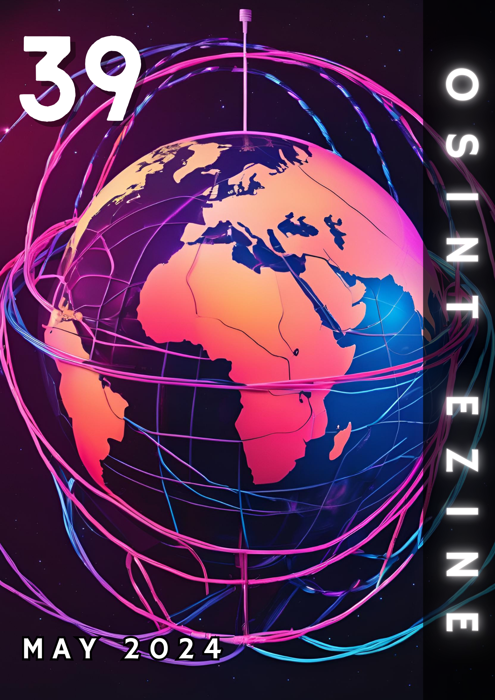

# 05 - May 2024

<figure><figcaption></figcaption></figure>

Welcome to the May issue of the OSINT eZine (_#39_), this number includes topics such as crypto romance scams; several learning resources about OSINT methodologies; the OSINT research on the identity of the Lockbit leader; identifying misinformation and disinformation on social media platforms; a primer on blockchain technologies; AI generated malware and the first arrest about it; learning from mistakes in OSINT and OPSEC; AI being used to write police reports... and much more!

Hey Ho, Lets Go!:

* [AI: **OpenAI ChatGPT-4o, the eZine Pauses AI Models Coverage.**](05-may-2024.md#ai-openai-chatgpt-4o-the-ezine-pauses-ai-models-coverage)
* [AI: **The Dark Side of AI in Cybersecurity, AI-Generated Malware.**](05-may-2024.md#ai-the-dark-side-of-ai-in-cybersecurity-ai-generated-malware)
* [Crypto: **Blockchain for Beginners.**](05-may-2024.md#crypto-blockchain-for-beginners)
* [Crypto: **Combating Pig Butchering Scams.**](05-may-2024.md#crypto-combating-pig-butchering-scams)
* [Crypto: **When Blockchain Meets AI.**](05-may-2024.md#crypto-when-blockchain-meets-ai)
* [Learning: **OSINT Methodologies.**](05-may-2024.md#learning-osint-methodologies)
* [Learning: **The Importance of Making Mistakes in OSINT.**](05-may-2024.md#learning-the-importance-of-making-mistakes-in-osint)
* [News: **First AI Malware Arrest?**](05-may-2024.md#news-first-ai-malware-arrest)
* [Privacy: **Bad OPSEC, Learning from Mistakes.**](05-may-2024.md#privacy-bad-opsec-learning-from-mistakes)
* [Privacy: **What Can Go Wrong When Police Use AI to Write Reports?**](05-may-2024.md#privacy-what-can-go-wrong-when-police-use-ai-to-write-reports)
* [Techniques: **Analyzing White Nationalist X Accounts Amid the War in Gaza.**](05-may-2024.md#techniques-analyzing-white-nationalist-x-accounts-amid-the-war-in-gaza)
* [Techniques: **How the Kremlin Launders Disinformation Around the Globe.**](05-may-2024.md#techniques-how-the-kremlin-launders-disinformation-around-the-globe)
* [Techniques: **Identifying and Characterizing Super-spreaders of Low-Credibility Content on Twitter.**](05-may-2024.md#techniques-identifying-and-characterizing-super-spreaders-of-low-credibility-content-on-twitter)
* [Techniques: **Lockbit Leader Identity OSINTed.**](05-may-2024.md#techniques-lockbit-leader-identity-osinted)
* [Tools: **AttackGen.**](05-may-2024.md#tools-attackgen)
* [Tools: **Taranis.**](05-may-2024.md#tools-taranis)
* [Web3: **Trend Report of Virtual Worlds.**](05-may-2024.md#web3-trend-report-of-virtual-worlds)

***

### AI: OpenAI ChatGPT-4o, the eZine Pauses AI Models Coverage.

OpenAI has launched its new model ChatGPT-4o, Google as well, Meta last April... I have to admit that the speed of releases with the current functionalities for OSINT doesn't match. Most tools and resources using AI for OSINT still relies on ChatGPT-3.5 so I have decided to stop covering their releases in this eZine. You will find AI related news, AI-based tools and as soon as there is something relevant for OSINT or Cybersecurity, I will share it with the community but I will not cover the 'monthly' update with new models unless it is relevant, as usual, I only want to share quality with you instead of quantity. 

***

### AI: The Dark Side of AI in Cybersecurity, AI-Generated Malware.

When asked about the possibility of AI generating malware, Bar Matalon and Rem Dudas, researchers for the cybersecurity company Palo Alto Networks, responded unequivocally, stating, "The answer is yes. And there is a bit of a longer version for that answer. It's a lot more complex than it seems at first." The researchers embarked on a journey to generate malware samples based on MITRE ATT\&CK techniques, and while the initial results were lackluster, they persevered and eventually generated samples that were both sophisticated and alarming.

[https://www.paloaltonetworks.com/blog/2024/05/ai-generated-malware/](https://www.paloaltonetworks.com/blog/2024/05/ai-generated-malware/) 

***

### Crypto: Blockchain for Beginners.

The EU Blockchain Observatory and Forum published a guide on basics about blockchain technologies. From fundamental concepts such as what is a blockchain, to the different types of technologies deployed or its different uses such as finance; healthcare; voting or intellectual property.

[https://blockchain-observatory.ec.europa.eu/publications/blockchain-beginners-basic-guiding-principles\_en](https://blockchain-observatory.ec.europa.eu/publications/blockchain-beginners-basic-guiding-principles_en) 

***

### Crypto: Combating Pig Butchering Scams.

First part of a series of articles about investigations on crypto scams, in this case, using pig butchering schemes sometimes referred to as a cryptocurrency “investment scam” or “romance scam,” in which the scammer uses a combination of establishing confidence with the victim to trick and manipulate the victim into investing in a fraudulent cryptocurrency scheme.

[https://www.zeroshadow.io/post/combating-crypto-scams-in-south-asian-circles-part-1](https://www.zeroshadow.io/post/combating-crypto-scams-in-south-asian-circles-part-1) 

***

### Crypto: When Blockchain Meets AI.

A research by the company Elliptic, were they work with a dataset of more than 200 million crypto transactions to train an AI model to identify “subgraphs”, chains of transactions that represent bitcoin being laundered. By identifying these subgraphs rather than illicit wallets, this approach allowed them to focus on the “multi-hop” laundering process more generally rather than the on-chain behavior of specific illicit actors.

[https://www.elliptic.co/blog/our-new-research-enhancing-blockchain-analytics-through-ai](https://www.elliptic.co/blog/our-new-research-enhancing-blockchain-analytics-through-ai) 

***

### Learning: OSINT Methodologies.

During this month, several experts have shared different methodologies and strategies on performing online investigations. From all of them, I have collected the following ones for this issue:

Aaron Roberts _aka_ @AaronCTI, is a well-know cyber-threat intelligence investigator author of several books and resources of interest. This month he shared a methodology on how to perform open source intelligence investigations.

[https://aaroncti.com/my-osint-blueprint-methodology-and-tools-part-one/](https://aaroncti.com/my-osint-blueprint-methodology-and-tools-part-one/)

Micah Hoffman _aka_ @Webbreacher, published a similar article to the latter about 10 steps for improving your OSINT skills.

[https://authentic8.com/blog/10-steps-osint-mastery](https://authentic8.com/blog/10-steps-osint-mastery)

Ginger T from CQCORE, also shared a blog post, inspired by the previous ones, on how to perform open source investigations.

[https://www.cqcore.uk/osint-methodology/](https://www.cqcore.uk/osint-methodology/) 

***

### Learning: The Importance of Making Mistakes in OSINT.

This month seems that all the OSINT experts around the world have decided to write about methodologies, lessons learned or ways to improve our skills. Sofia Santos _aka_ @Gralhix, has published an article about embracing failure and how to raise better and stronger after it.

[https://gralhix.com/2024/05/18/embracing-failure-the-importance-of-making-mistakes-in-osint/](https://gralhix.com/2024/05/18/embracing-failure-the-importance-of-making-mistakes-in-osint/) 

***

### News: First AI Malware Arrest?

A 25 years old Japanese citizen was arrested in the south of Tokyo for creating malware by the use of AI.

Now it's when the "funny" part of this history kicks in. The suspect had no IT expertise but he managed by using online AI services like ChatGPT, to create a ransomware virus that encrypts content and asks for crypto as ransom... I have check multiple sources and the news seemed true but I am still impressed on how someone with no IT skills at all is able to create a full functional malware with free and open resources...

[https://www3.nhk.or.jp/nhkworld/en/news/20240528\_22/](https://www3.nhk.or.jp/nhkworld/en/news/20240528_22/) 

***

### Privacy: Bad OPSEC, Learning from Mistakes.

A compilation of mistakes and failures that should help as inspiration on what not to do and how we can protect better our identities.

[https://github.com/jermanuts/bad-opsec](https://github.com/jermanuts/bad-opsec) 

***

### Privacy: What Can Go Wrong When Police Use AI to Write Reports?

This article talks about a new product, developed by a major security company, that provides services globally to different law enforcement agencies, that consists on an artificial intelligence generative large language model that transforms audio and video from cameras to police reports. In the post, the authors emphasize the risks and dangers of the use of this kind of technology for activities that involve the rights of citizens.

[https://www.eff.org/deeplinks/2024/05/what-can-go-wrong-when-police-use-ai-write-reports](https://www.eff.org/deeplinks/2024/05/what-can-go-wrong-when-police-use-ai-write-reports) 

***

### Techniques: Analyzing White Nationalist X Accounts Amid the War in Gaza.

An analysis about several white nationalist social media accounts, particularly on X, that have taken advantage of the crisis to radicalize users and spread antisemitic and Islamophobic propaganda. They have also subtly inserted their own foreign policy preferences into the mix that they have occasionally tied to the larger ongoing conflict.

[https://gnet-research.org/2024/05/20/two-paths-same-destination-analysing-white-nationalist-x-accounts-amid-the-war-in-gaza/](https://gnet-research.org/2024/05/20/two-paths-same-destination-analysing-white-nationalist-x-accounts-amid-the-war-in-gaza/) 

***

### Techniques: How the Kremlin Launders Disinformation Around the Globe.

The Centre for Information Resilience (CIR) explored the Russian influence operations that have attempted to spread disinformation, sow division and undermine democracy. It contains valuable resources about disinformation campaigns, spotting fake news and techniques that can be applied to investigate the phenomena.

[https://www.info-res.org/post/how-the-kremlin-launders-disinformation-around-the-globe](https://www.info-res.org/post/how-the-kremlin-launders-disinformation-around-the-globe) 

***

### Techniques: Identifying and Characterizing Super-Spreaders of Low-Credibility Content on Twitter.

A quantitative analysis that by using simple metrics, is able to predict the top super-spreaders, the users who consistently disseminate disproportionate amounts of low-credibility content, several months into the future.

[https://doi.org/10.1371/journal.pone.0302201](https://doi.org/10.1371/journal.pone.0302201) 

***

### Techniques: Lockbit Leader Identity OSINTed.

The identity of the Lockbit ransomware group leader was revealed at the beginning of May and several OSINT experts revealed different ways how they were able to unveil its identity. The following archived Tweet contains an entire thread on how the identity of the suspect was unmasked.

[https://threadreaderapp.com/thread/1787852663595454807.html](https://threadreaderapp.com/thread/1787852663595454807.html) [https://web.archive.org/web/20240507215024/https://threadreaderapp.com/thread/1787852663595454807.html](https://web.archive.org/web/20240507215024/https://threadreaderapp.com/thread/1787852663595454807.html) 

***

### Tools: AttackGen.

What happens when you give the MITRE ATT\&CK framework to a LLM (large-language model)? That it creates AttackGen, a cybersecurity incident response testing tool that leverages the power of large language models to generate tailored incident response scenarios based on user-selected threat actor groups and your organization's details.

[https://github.com/mrwadams/attackgen](https://github.com/mrwadams/attackgen) 

***

### Tools: Taranis.

Taranis AI is an advanced Open-Source Intelligence (OSINT) tool, leveraging Artificial Intelligence to revolutionize information gathering and situational analysis. Taranis navigates through diverse data sources like websites to collect unstructured news articles, utilizing Natural Language Processing (NLP) and Artificial Intelligence to enhance content quality. Analysts then refine these AI-augmented articles into structured reports that serve as the foundation for deliverables such as PDF files, which are ultimately published.

[https://github.com/taranis-ai/taranis-ai](https://github.com/taranis-ai/taranis-ai) 

***

### Web3: Trend Report of Virtual Worlds.

The EU Blockchain Observatory and Forum published this month a trend report on Virtual Worlds, Metaverses and "Web4" corresponding to the state of the art updated till July 2023. It barely mentions the potential of AI when used on these technologies but I hope we will see it promoted and featured in future releases.

[https://blockchain-observatory.ec.europa.eu/publications/trend-report-virtual-worlds-metaverse\_en](https://blockchain-observatory.ec.europa.eu/publications/trend-report-virtual-worlds-metaverse_en) 

***

_Don't spend time beating on a wall, hoping to transform it into a door._

_\~Coco Chanel, French Fashion Designer._
