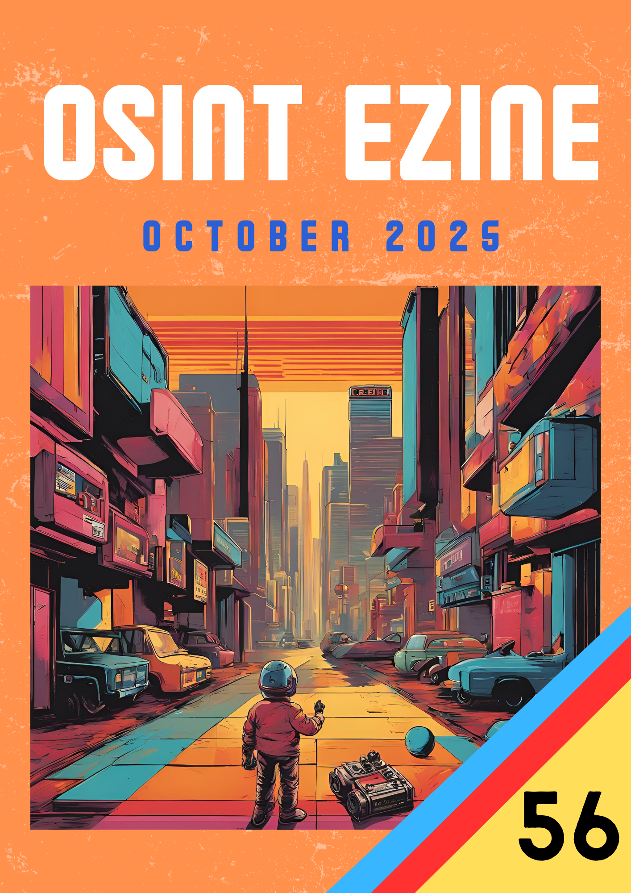

# 10 - October 2025

<figure><figcaption></figcaption></figure>

Welcome to the October issue of the OSINT eZine ([_#56_](https://therealguyinblack.gitbook.io/osint-ezine/osint-ezine/2025)). This issue includes topics such as Microsoft Copilot’s local-file automation; new KYC trends in crypto; how surveillance companies track phones globally; the EU’s finding against TikTok and Meta; enterprise spyware concerns; Bellingcat’s maritime OSINT; new tools for investigators… and much more!

Hey Ho, Lets Go!:

* [AI: **Copilot on Windows Working with your Files.**](10-october-2025.md#ai-copilot-on-windows-working-with-your-files)
* [Crypto: **KYC in Crypto.**](10-october-2025.md#crypto-kyc-in-crypto)
* [Crypto: **Crypto is King.**](10-october-2025.md#crypto-crypto-is-king)
* [Learning: **Phone Tracking Secrets.**](10-october-2025.md#learning-phone-tracking-secrets)
* [Learning: **Legendary\_OSINT.**](10-october-2025.md#learning-legendary_osint)
* [Learning: **Cybercrime and Counterintelligence.**](10-october-2025.md#learning-cybercrime-and-counterintelligence)
* [Learning: **Islamic State Information Technology Series.**](10-october-2025.md#learning-islamic-state-information-technology-series)
* [News: **Discord Age Verification Breach.**](10-october-2025.md#news-discord-age-verification-breach)
* [News: **EU Finds TikTok and Meta Breach Transparency Obligations.**](10-october-2025.md#news-eu-finds-tiktok-and-meta-breach-transparency-obligations)
* [News: **ICC Moves to Open-Source Office Suite.**](10-october-2025.md#news-icc-moves-to-open-source-office-suite)
* [Privacy: **Microsoft Tracks Copilot AI Usage.**](10-october-2025.md#privacy-microsoft-tracks-copilot-ai-usage)
* [Privacy: **“I Have Nothing to Hide”.**](10-october-2025.md#privacy-i-have-nothing-to-hide)
* [Techniques: **OSINTBox.**](10-october-2025.md#techniques-osintbox)
* [Techniques: **Russia’s Grain-Smuggling Fleet.**](10-october-2025.md#techniques-russias-grain-smuggling-fleet)
* [Techniques: **Handling Digital Evidence – Forensic OSINT Guide.**](10-october-2025.md#techniques-handling-digital-evidence-forensic-osint-guide)
* [Tools: **VERT.**](10-october-2025.md#tools-vert)
* [Tools: **Nmap Network Scanning Update.**](10-october-2025.md#tools-nmap-network-scanning-update)
* [Tools: **Flowsint.**](10-october-2025.md#tools-flowsint)

***

### AI: Copilot on Windows Working with your Files.

Microsoft’s Copilot on Windows gains a new ability to handle local files in the background while the user performs other tasks. This update extends AI integration beyond cloud contexts, improving offline workflows and information retrieval, relevant for analysts using local data in investigations.

[https://www.neowin.net/amp/copilot-on-windows-can-now-work-with-your-local-files-while-you-do-something-else/](https://www.neowin.net/amp/copilot-on-windows-can-now-work-with-your-local-files-while-you-do-something-else/)

***

### Crypto: KYC in Crypto.

ShadowDragon explores the growing enforcement of Know-Your-Customer (KYC) procedures in the cryptocurrency sector. The post analyses how regulation, decentralization and anonymity intersect, shaping future compliance and tracing capabilities within digital-asset markets.

[https://shadowdragon.io/blog/kyc-in-crypto/](https://shadowdragon.io/blog/kyc-in-crypto/)

***

### Crypto: Crypto is King.

An OSINTimes piece reflecting on how cryptocurrency remains central to financial innovation despite regulatory and reputational pressures. It stresses how blockchain analysis remains a core competence for open-source investigators following illicit finance.

[https://osintimes.substack.com/p/crypto-is-king](https://osintimes.substack.com/p/crypto-is-king)

***

### Learning: Phone Tracking Secrets.

Mother Jones reveals a complex surveillance ecosystem involving Altamides, the FirstWAP mobile-tracking platform and links to high-profile financiers. The investigation exposes global location-tracking networks useful for understanding mobile-OSINT and spyware operations.

[https://www.motherjones.com/politics/2025/10/firstwap-altamides-phone-tracking-surveillance-secrets-assad-erik-prince-jared-leto-anne-wojcicki/](https://www.motherjones.com/politics/2025/10/firstwap-altamides-phone-tracking-surveillance-secrets-assad-erik-prince-jared-leto-anne-wojcicki/)

***

### Learning: Legendary\_OSINT.

An open-source repository compiling OSINT guides, datasets and utilities. Legendary\_OSINT serves as a structured resource for analysts seeking to practice investigative workflows and automate information collection.

[https://github.com/K2SOsint/Legendary\_OSINT](https://github.com/K2SOsint/Legendary_OSINT)

***

### Learning: Cybercrime and Counterintelligence.

The SANS Institute shared an interesting blog post dedicated to cybercrime investigations and counter-intelligence tradecraft. It provides practical insight into attribution, threat actor profiling and digital-forensics procedures on cases such as Europol EPE platform hack or FBI InfraGard.

[https://www.sans.org/blog/for589-cybercrime-counterintelligence](https://www.sans.org/blog/for589-cybercrime-counterintelligence)

***

### Learning: Islamic State Information Technology Series.

The Electronic Horizon Foundation highlights how the Islamic State promotes cybersecurity and anonymity through its new “security tips” series. The report underscores the group’s evolving digital-operations guidance and its implications for counter-terrorism monitoring.

[https://gnet-research.org/2025/10/30/islamic-state-information-technology-the-new-security-tips-series-of-electronic-horizon-foundation-2/](https://gnet-research.org/2025/10/30/islamic-state-information-technology-the-new-security-tips-series-of-electronic-horizon-foundation-2/)

***

### News: Discord Age Verification Breach.

Proton reports a security incident affecting Discord’s age-verification process. The breach exposed user-submitted identification data, raising privacy and compliance concerns for digital-platform investigations.

[https://proton.me/blog/discord-age-verfication-breach](https://proton.me/blog/discord-age-verfication-breach)

***

### News: EU Finds TikTok and Meta Breach Transparency Obligations.

The European Commission’s preliminary findings under the Digital Services Act conclude that TikTok and Meta violated transparency and researcher-access duties. The decision could result in significant fines and sets precedent for large-platform accountability and data-access in OSINT work.

[https://digital-strategy.ec.europa.eu/en/news/commission-preliminarily-finds-tiktok-and-meta-breach-their-transparency-obligations-under-digital](https://digital-strategy.ec.europa.eu/en/news/commission-preliminarily-finds-tiktok-and-meta-breach-their-transparency-obligations-under-digital)

***

### News: ICC Moves to Open-Source Office Suite.

The International Criminal Court is migrating from Microsoft Office to a European open-source alternative, reinforcing Europe’s software-sovereignty movement and long-term independence from US-based vendors.

[https://www.euractiv.com/news/international-criminal-court-to-ditch-microsoft-office-for-european-open-source-alternative/](https://www.euractiv.com/news/international-criminal-court-to-ditch-microsoft-office-for-european-open-source-alternative/)

***

### Privacy: Microsoft Tracks Copilot AI Usage.

Pivot-to-AI reveals that Microsoft collects extensive telemetry on Copilot AI usage, including prompts and session data, for enterprise “productivity insights”. The article highlights privacy challenges in AI adoption within corporate environments.

[https://pivot-to-ai.com/2025/10/13/microsoft-tracks-your-copilot-ai-usage-in-its-workplace-spyware/](https://pivot-to-ai.com/2025/10/13/microsoft-tracks-your-copilot-ai-usage-in-its-workplace-spyware/)

***

### Privacy: “I Have Nothing to Hide”.

Threema’s blog revisits the classic privacy argument, showing how metadata and behavioral analysis can still profile users even without message content. It is a concise defense of privacy-by-design principles.

[https://threema.com/en/blog/i-have-nothing-to-hide](https://threema.com/en/blog/i-have-nothing-to-hide)

***

### Techniques: OSINTBox.

ShellWriter’s OSINTBox blog compiles current methods and tools for digital investigations. It includes search-operator refinements, visual-timeline creation and workflow scripting tips.

[https://osintbox.shellwriter.com/](https://osintbox.shellwriter.com/)

***

### Techniques: Russia’s Grain-Smuggling Fleet.

Bellingcat uncovers how Russia continues maritime grain smuggling through flag-of-convenience vessels and trans-shipment routes. A clear case of applied OSINT with AIS data, satellite imagery and registry cross-checking.

[https://www.bellingcat.com/news/2025/10/23/russias-grain-smuggling-fleet-continues-undeterred/](https://www.bellingcat.com/news/2025/10/23/russias-grain-smuggling-fleet-continues-undeterred/)

***

### Techniques: Handling Digital Evidence – Forensic OSINT Guide.

OSINT Industries offers a complete guide on handling and preserving digital evidence. It addresses chain of custody, metadata retention and verification, merging forensic discipline with open-source practice.

[https://www.osint.industries/post/handling-digital-evidence-our-ultimate-guide-to-forensic-osint](https://www.osint.industries/post/handling-digital-evidence-our-ultimate-guide-to-forensic-osint)

***

### Tools: VERT.

VERT, an open-source utility that provides visualization and threat-scanning modules useful for infrastructure analysis and network reconnaissance.

[https://github.com/VERT-sh/VERT](https://github.com/VERT-sh/VERT)

***

### Tools: Nmap Network Scanning Update.

CybersecurityNews summarizes the latest improvements in Nmap, including new NSE scripts and fingerprint updates. A timeless staple for investigators mapping network surfaces.

[https://cybersecuritynews.com/nmap-tool-for-network-scanning/](https://cybersecuritynews.com/nmap-tool-for-network-scanning/)

***

### Tools: Flowsint.

Flowsint.io introduces a transaction-flow visualization tool for crypto and financial tracing. It simplifies pattern recognition in blockchain analysis and entity relationship mapping.

[https://www.flowsint.io/](https://www.flowsint.io/)

***

\

_“We all have our time machines. Some take us back, they’re called memories. Some take us forward, they’re called dreams”_

_\~ H. G. Wells, English writer._

